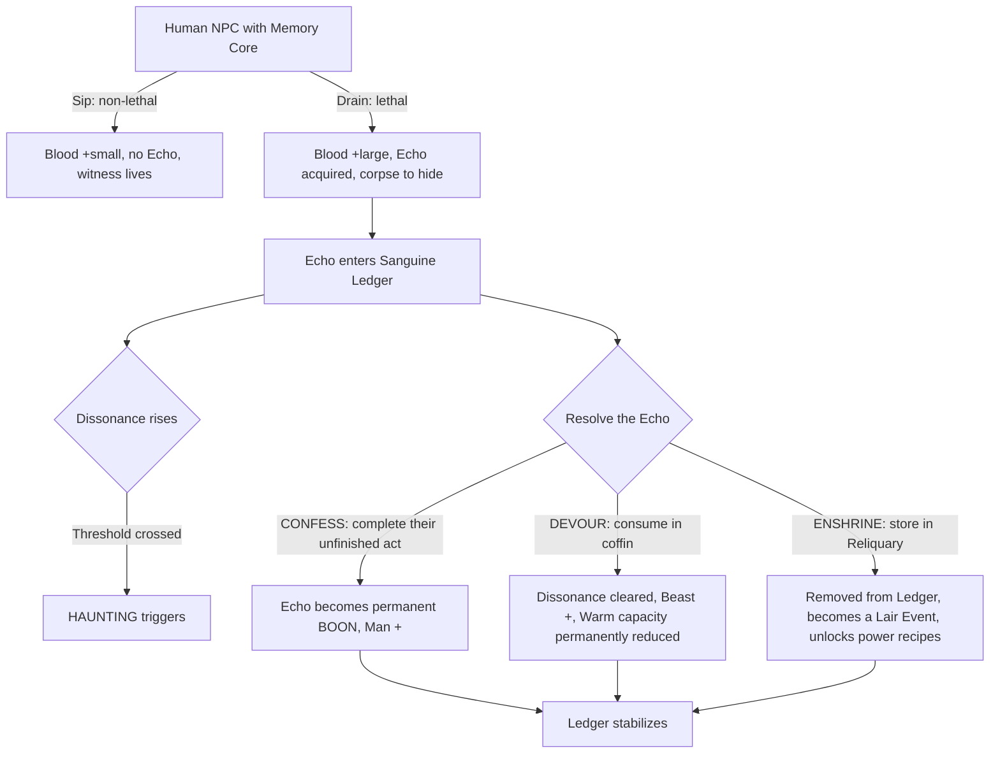
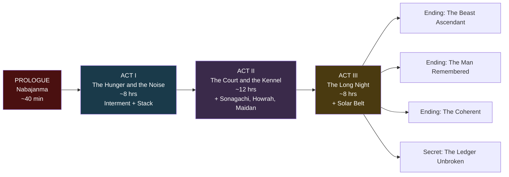
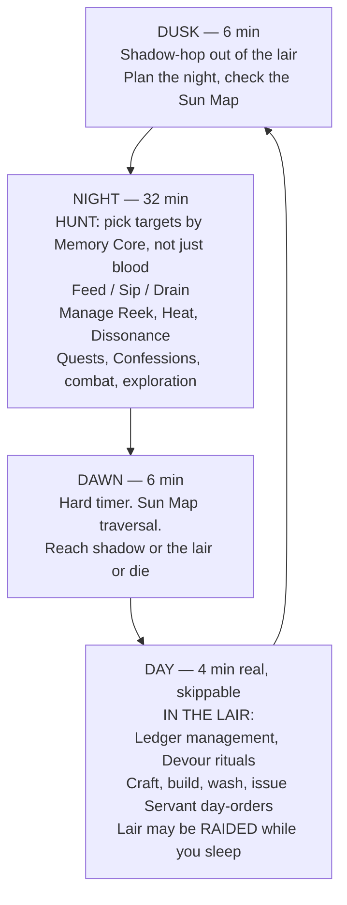
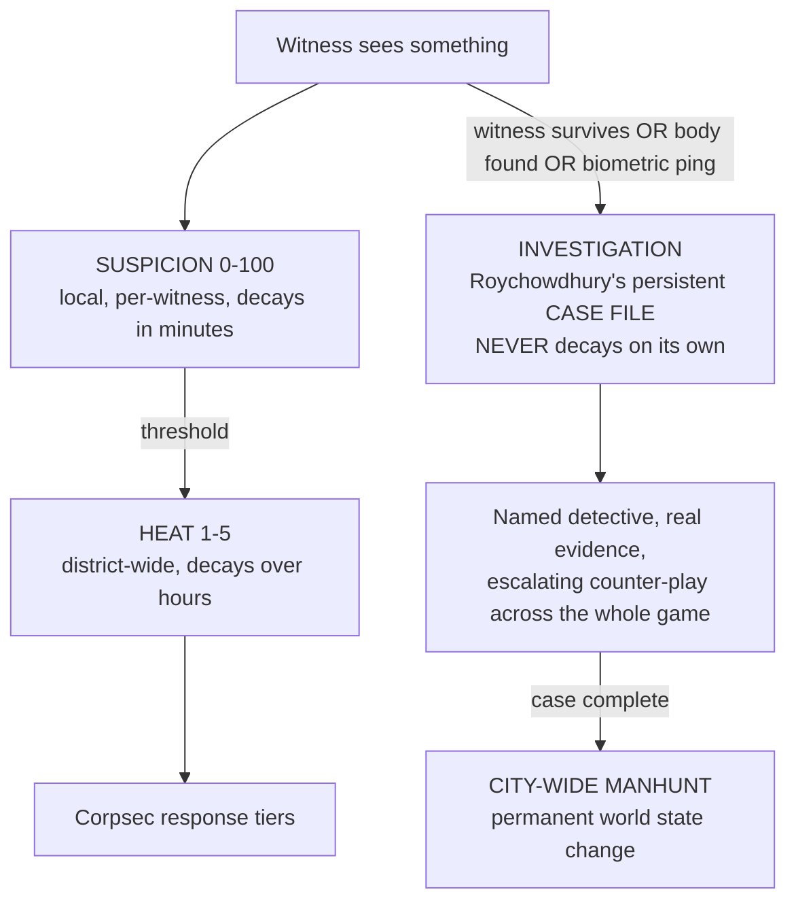
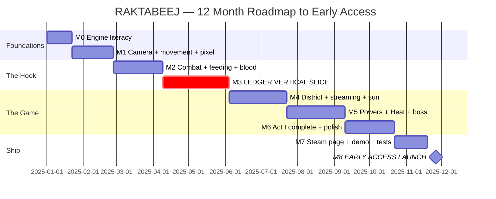

# RAKTABEEJ — The Long Night of Kalighat
## Game Design Document & Product Requirements Document

> **Status:** v1.0 — Source of Truth
> **Working Title:** RAKTABEEJ *(alt: "Old Blood, New Neon", "The Sanguine Ledger", "Coldblood Sprawl")*
> **Genre:** Open-world action-survival RPG with psychological progression
> **Engine:** Godot 4.7.2 (.NET), C# primary — pinned, see `docs/TOOLCHAIN.md`
> **Platforms:** Windows (v1.0) → macOS/Linux (v1.1) → Android/iOS (post-1.0) → Console (only if commercially viable)
> **Team:** 1 developer (solo, AI-assisted)
> **Target:** Steam Early Access, ~12 months from project start
> **Budget:** $100 minimum (Steam Direct fee); everything else free or optional

---

## Table of Contents

1. [Executive Summary](#1-executive-summary)
2. [Design Pillars](#2-design-pillars)
3. [The Core Hook: The Sanguine Ledger](#3-the-core-hook-the-sanguine-ledger)
4. [World & Setting](#4-world--setting)
5. [Narrative & Story](#5-narrative--story)
6. [Camera Specification](#6-camera-specification)
7. [Controls](#7-controls)
8. [Core Gameplay Loop](#8-core-gameplay-loop)
9. [Blood & Feeding Systems](#9-blood--feeding-systems)
10. [Survival Systems](#10-survival-systems)
11. [Powers & Progression](#11-powers--progression)
12. [Combat](#12-combat)
13. [Antagonist Systems: Heat, Investigation, Werewolves](#13-antagonist-systems-heat-investigation-werewolves)
14. [The Lair](#14-the-lair)
15. [Vehicles](#15-vehicles)
16. [Minigames & Comprehension](#16-minigames--comprehension)
17. [Economy, Crafting & Gear](#17-economy-crafting--gear)
18. [Art Direction & Visual Pipeline](#18-art-direction--visual-pipeline)
19. [Audio Direction](#19-audio-direction)
20. [UX, UI, Accessibility & Localization](#20-ux-ui-accessibility--localization)
21. [Technical Architecture](#21-technical-architecture)
22. [Engine & Platform Decision Record](#22-engine--platform-decision-record)
23. [Toolchain & Cost Budget](#23-toolchain--cost-budget)
24. [Production Roadmap](#24-production-roadmap)
25. [Task Breakdown](#25-task-breakdown)
26. [Working With an AI Coding Agent](#26-working-with-an-ai-coding-agent)
27. [Risk Register](#27-risk-register)
28. [Business, Marketing & Legal](#28-business-marketing--legal)
29. [Open Questions](#29-open-questions)
30. [Appendices](#30-appendices)

---

## 1. Executive Summary

### 1.1 One-Line Pitch

You are a 19th-century vampire dug out of a sacred grave by a construction crew in 2070 Kolkata, and every person you drink to survive leaves their memories inside you — memories that overwrite your senses, your map, your controls, and eventually your identity.

### 1.2 Elevator Pitch

**RAKTABEEJ** is a top-down open-world survival RPG in the mould of *V Rising* and *Project Zomboid*, set in the Kalighat Sprawl — a drowned, vertical, neon-choked Kolkata in the year 2070. You play Vikramaditya Sen, interred beneath a Kali shrine in 1861 and accidentally exhumed by a corporate demolition crew.

You wake starving into a world of screens, engines, and light that you cannot read and do not understand. To survive you must feed. But feeding is not free: each victim's **core memory** enters your **Sanguine Ledger**, and the Ledger haunts you. The city flickers back to 1861 mid-chase. Your ability icons scramble. Dead men walk beside living crowds. A dead woman's love of stray dogs becomes a compulsion you must obey or suffer.

Your powers are not bought with experience points. They are *assembled from memories*. To learn flight you must drink someone who knew falling. To learn Dominate you must drink someone who knew obedience. Hunting stops being about blood and becomes about biography.

And hunting you is **Colonel Ambrose Thorne** — the werewolf who slaughtered your mortal family in 1861, who never died, and who in 2070 is the CEO of the corporation whose bulldozer woke you up.

### 1.3 What Makes It Different

| Most vampire games | RAKTABEEJ |
|---|---|
| Feeding is a resource tap | Feeding is a permanent, irreversible character-authoring decision |
| Progression is an XP tree | Progression requires *specific* victims with *specific* biographies |
| "Corruption meter" changes dialogue | Corruption changes your **HUD, map, audio, and input authority** |
| Generic Night City / Transylvania | Historically coherent colonial-to-cyberpunk Kolkata with a real mythological spine |
| Villain is a boss at the end | Villain **is** the police/corporate pressure system you fight all game |
| Morality is good vs evil | Morality is **coherence vs incoherence** — both extremes are powerful and both cost you |

### 1.4 Target Audience

- **Primary:** *V Rising*, *Vampire Survivors*-adjacent action-RPG players; *Project Zomboid* / *Kenshi* systemic-survival players; ages 18–35, PC, Steam.
- **Secondary:** Narrative-systems players (*Disco Elysium*, *Pathologic*, *Darkest Dungeon* affliction fans).
- **Tertiary:** Pixel-art/indie aesthetic followers; South Asian players underserved by AAA settings.
- **Rating target:** ESRB M / PEGI 18. Blood, violence, drug references, thematic darkness. No sexual content.

---

## 2. Design Pillars

Every feature must serve at least one pillar. If it serves none, cut it.

### Pillar 1 — **The Anachronism Is the Game**
The comedy, horror, and challenge all come from a predator from 1861 operating in 2070. He cannot read a sign, drive a car, or use a touchscreen until he *learns*. Modern technology is a puzzle, a threat, and eventually a weapon. Never let the player forget the century gap.

### Pillar 2 — **Every Meal Is a Permanent Decision**
No feeding is neutral. Blood is the resource, memory is the price, and both compound. The player should hesitate before every kill by hour ten.

### Pillar 3 — **The Haunting Is Mechanical, Never Cosmetic**
A haunting that only changes the screen tint is a failure. Hauntings must alter what the player *can do*: their map, their controls, their information, their objectives. The player must play *around* their own psyche.

### Pillar 4 — **The City Is an Antagonist With a Body**
Corpsec, UV streetlights, solar arrays, biometric gates, bio-sniffers, and a named detective building a real case file. The city notices, remembers, adapts, and hunts. Thorne's power is expressed through infrastructure, not cutscenes.

### Pillar 5 — **Power Should Cost Identity**
Beast strength and Human utility are mutually corrosive. The build the player ends with should be a confession of how they played, and the ending should feel earned, not selected from a menu.

### Pillar 6 — **Readable First, Pretty Second**
Pixel-art 3D at low internal resolution, but combat, threat, and shadow-safety must be legible at a glance. UI renders at native resolution. Never sacrifice clarity for aesthetic purity.

---

## 3. The Core Hook: The Sanguine Ledger

**This is the MVP. If this system is not fun by month 6, the project pivots or stops. Everything else is scaffolding for this.**

### 3.1 Overview

Every human NPC in the Sprawl carries a **Memory Core**. Drink them to death and that Core becomes an **Echo** in your **Sanguine Ledger**. Echoes are simultaneously your progression currency, your debuff source, and your narrative content.



### 3.2 Memory Core Composition

Each NPC is procedurally assembled at spawn from authored fragments — cheap to produce, high in variety:

```
MemoryCore
├── DominantEcho    (1)  — the defining memory of this life
├── MinorEchoes     (0–2) — texture, small mechanical riders
├── Valence         — Warm | Cold | Ambivalent
├── Tags            — [flight, obedience, violence, tenderness, craft, faith, water, fire, code, ...]
├── AnchorSite      — a world location tied to the memory (their flat, a tea stall, a shrine)
└── UnfinishedAct   — the thing they never got to do (the Confession objective)
```

**Archetype-tagged pools** drive believability. A courier's Echo pool contains speed, routes, rain, deadlines, a dog that chases her every Tuesday. A Corpsec officer's pool contains obedience, a bad order followed, a partner's death, a son he doesn't call. Authoring ~25 Echoes per archetype × 12 archetypes = 300 Echoes, which combinatorially yields tens of thousands of distinct lives.

### 3.3 Valence, and Why Warm Is Also Dangerous

| | **Cold Echoes** (terror, grief, hatred, shame) | **Warm Echoes** (love, joy, pride, tenderness) |
|---|---|---|
| Grants | Combat power, damage, speed, ferocity | Utility, social access, Comprehension, crafting insight |
| Pushes Resonance toward | **Beast** | **Man** |
| Unique penalty | Rage bleed: powers occasionally fire without input | **Hesitation**: a mechanical flinch (0.4s feed interrupt) when feeding on an NPC resembling the memory's subject |
| Haunting flavour | Aggressive, loud, violent intrusions | Quiet, sorrowful, disorienting intrusions |

Warm Echoes making you *worse at hunting* is the crucial balance. Mercy is not a free win; it is a different tax. Players cannot simply farm nice memories.

### 3.4 Dissonance

**Dissonance (0–100)** is the pressure meter.

- Each absorbed Echo adds base Dissonance (8–20 by Echo weight).
- **Conflict multiplier:** absorbing Echoes with opposed tags in the same night multiplies the gain (a mother's devotion + a child-killer's satisfaction = ×2.0). This makes *who you hunt, in what order, on which night* a real tactical decision.
- Dissonance decays slowly during coffin rest, but never to zero while unresolved Echoes remain.
- Thresholds: **25 (Murmurs) / 50 (Bleed) / 75 (Fracture) / 90 (Collapse)**. Higher tiers trigger stronger, longer hauntings and unlock the most dangerous-but-powerful Echo abilities.
- At 100, **Frenzy**: you lose control entirely for 20–40 seconds, attack everything nearby including allies and servants, and wake with a mass-casualty scene and maximum Heat. Frenzy is a fail-state you survive, not a death.

### 3.5 The Seven Hauntings

Each is a *systemic intrusion* with a defined duration, a defined mechanical effect, and a defined counterplay. **Every haunting has a photosensitivity-safe variant (see §20.3).**

**H1 — Overlay Bleed** *(signature haunting; this is the trailer moment)*
The world re-renders as 1861 Calcutta. Cobblestones over asphalt, gas lamps over holo-signage, horse-drawn tongas where cars are, colonial facades over arcology towers. **The physical world does not change** — the tram you cannot see will still kill you. You must navigate 2070 collision using an 1861 map. Duration 20–60s.
*Counterplay:* memorize routes; Rat/Pariah Form uses smell not sight and is unaffected; stand still and wait it out.

**H2 — Phantom Crowds**
Past victims spawn as apparently-normal NPCs woven into living crowds. Sanguine Sight reveals them (no blood signature) but costs blood to run. Attacking a phantom = you swing at empty air in public → large Suspicion spike. Duration 60–120s.
*Counterplay:* use Sanguine Sight before committing; avoid crowds; the phantoms cast no shadow under streetlights, a free visual tell for observant players.

**H3 — Name Loss**
The HUD degrades. Ability icons scramble into unreadable glyphs, cooldown numbers become Devanagari/Bengali numerals you have not learned, quest markers detach from targets, and the minimap reverts to the 1861 street grid. Duration 45–90s.
*Counterplay:* muscle memory. Rewards players who learn their keybinds over reading their bar.

**H4 — Compulsion**
The Echo imposes a directive with real stakes. *"She fed the strays behind the Beniapukur stall every dawn."* Feed three stray dogs before sunrise → Dissonance −15 and the Echo softens. Refuse or fail → the Echo turns permanently Cold and Dissonance +10. Duration: until resolved or dawn.
*Counterplay:* it's a choice, not a debuff. Comply for stability, refuse for time.

**H5 — Sensory Inversion**
The victim's final thoughts play as looping VO over the ambient mix, and it **masks the audio cues you rely on** — footsteps behind you, siren approach, the werewolf's breathing. Duration 30–60s.
*Counterplay:* Bat Sonar ability; rely on Sanguine Sight; retreat to a quiet interior.

**H6 — Puppeting**
One ability slot loses input authority. Pressing it fires whatever the Echo wants instead — sometimes helpfully, usually not. A soldier's Echo might make your utility slot fire a lunge attack. Duration 30–45s.
*Counterplay:* re-slot abilities mid-fight; build loadouts with redundancy.

**H7 — Mirror Refusal**
Every reflective surface — and 2070 Kolkata is *made* of screens — shows the victim's face instead of yours. Biometric mirrors, shop windows, ad-boards, puddles. Mechanically: biometric checkpoints will now flag you as the *dead person*, and if that death has been reported, walking past a scanner raises Investigation directly. Duration 90–180s.
*Counterplay:* stay off the grid, use undercity routes, or exploit it — deliberately trigger scans to frame someone else.

### 3.6 Resolution: Confess, Devour, Enshrine

A haunting system with no outlet is punishment. Three outlets, each a real strategic identity:

**CONFESS** *(the long road — Man)*
Travel to the Echo's AnchorSite and perform its UnfinishedAct: deliver the letter, pay the debt, light the lamp, tell the daughter her father was proud. Each is a short, hand-authored micro-quest (30 s – 4 min).
→ Echo becomes a **Boon** (permanent passive, e.g. *"Courier's Legs: +6% movement in rain"*), Dissonance clears fully, **Man +**.
*Cost:* night-hours, which are your scarcest resource. Confessing is choosing not to hunt.

**DEVOUR** *(the short road — Beast)*
Rest in the coffin and consume the Echo whole.
→ Dissonance from that Echo clears instantly, **Beast +**, and your **maximum Warm capacity is permanently reduced by 1**. Grants a **Beast Mark** (raw stat power, no utility).
*Cost:* irreversible. Devour enough and you can no longer hold a Warm Echo at all — the Man endings become mechanically unreachable. The game never warns you twice.

**ENSHRINE** *(the hoarder's road — Neutral)*
Store the Echo in your lair's **Memory Reliquary**.
→ Removed from your Ledger (no Dissonance), but the Reliquary itself becomes haunted. Enshrined Echoes manifest as **Lair Events**: a servant hums a dead woman's lullaby, a room re-skins to 1861, a phantom sits in your chair. Enough enshrinement and your lair becomes hostile territory.
*Payoff:* Enshrined Echoes are the **only** source of certain power recipes, are readable as full lore vignettes, and can be traded to the Nocturne Court for favours and to the Ashen Order for anti-Thorne intelligence.

### 3.7 The Ledger as the Progression Tree

**Powers are not bought. They are cooked from memories.** Each power has an **Echo Recipe** of required tags:

| Power | Echo Recipe | Diegetic logic |
|---|---|---|
| Bat Form (flight) | `flight` + `falling` + `height×2` | You must know what it is to leave the ground |
| Dominate | `obedience` + `authority` + `submission` | You must know both sides of a command |
| Pariah Form | `loyalty` + `hunger` + `street` | A dog's memory of a city |
| Sanguine Sight | `thirst` + `craving` + `addiction` | Any addict's blood teaches want |
| Wall-Cling | `climbing` + `vertigo` | Someone who scaled the Stack |
| Mist Form | `drowning` + `dissolution` + `water×2` | Loss of form |
| Asura Form | `rage` + `labour` + `endurance` | A body used as a tool |

This transforms hunting from "find blood" into **"find the person who knew this thing."** The player reads NPC archetypes, uses Sanguine Sight to inspect a target's Memory Core *before* committing, and hunts biographies. It is the single mechanic that makes the hook load-bearing across the whole game rather than a flavour system.

### 3.8 Resonance: MAN ←→ BEAST

A single axis, 0 (pure Beast) to 100 (pure Man), starting at 50. **Not good vs evil — coherence vs power.**

| | Beast-heavy (< 30) | Man-heavy (> 70) |
|---|---|---|
| Combat | +40% claw damage, +25% power potency, cheaper blood costs | −25% power potency |
| Shapeshifting | Faster, cheaper, longer duration | Expensive, short duration |
| **Guise (human disguise)** | Fails after 45 s; NPCs recoil at range | Indefinite; NPCs treat you as human |
| **Technology** | **Touchscreens do not register your touch.** Cannot drive, use guns, ATMs, terminals | Full tech access |
| Sun resistance | Higher (thick hide) | Lower |
| Dominate | Weak (you are a beast, not a lord) | Strong |
| Merchants / economy | Closed | Open |
| Servants | Fear you, low efficiency, may flee | Loyal, efficient |

The touchscreen detail is the pillar in miniature: go too feral and 2070 physically rejects you. Go too human and you cannot win a straight fight. **The final boss is beatable from either extreme by completely different means** (§5.6).

### 3.9 Comprehension — The Third Axis

**Comprehension (0–100)** is your literacy in the modern world. It is *the scope-management system*.

- At Comprehension 0, **all signage, UI text, and item names render as garbled glyphs.** As Comprehension rises, text resolves — first numerals, then common words, then everything. The player experiences illiteracy and then learns to read alongside the character. It costs almost nothing to implement (a progressive text-mangling filter) and is unforgettable.
- Gained by: absorbing Echoes with knowledge tags, **observing** activities (stand and watch someone drive for 90 s), playing minigames, reading enshrined Echoes, and Pixel's tutoring.
- **Comprehension gates the entire modern feature set:** driving, firearms, terminals, phones, transit, banking, minigames.

**This is why the feature list is achievable.** Vehicles, guns, and minigames are *late-game unlocks*, so they can ship in post-launch updates with perfect narrative justification. The Early Access roadmap is literally the vampire's education.

---

## 4. World & Setting

### 4.1 Why Kolkata

- Kolkata (Calcutta) was the **capital of British India until 1911**. A vampire active in the 1850s–60s and interred during the 1857 Rebellion era is historically coherent, not hand-waved.
- The **1861 ↔ 2070 overlay** becomes thematically loaded: colonial Calcutta bleeding through corporate neon. The haunting is *about* something.
- **Raktabeej** — the asura whose every spilled blood-drop spawned a duplicate, defeated when Kali drank his blood before it touched earth — is a native, distinctive vampire myth. Kalighat is Kali's shrine. The vampire interred beneath it is not a coincidence in-fiction.
- Real cyberpunk texture available for free: monsoon flooding, absurd population density, vertical slums, a colonial-era tram network, the Hooghly river, load-shedding blackouts, the Sundarbans.
- **Underserved setting** = marketing differentiation in a genre saturated with Neo-Tokyo pastiche.

> **Sensitivity note (mandatory):** Kali and Kalighat are living, actively-worshipped religious subjects. Treat them with research and respect. **Recommended approach:** the shrine in-game is a fictionalized composite ("the Ashen Shrine of the Devourer") rather than a depiction of the real Kalighat Temple, and the Ashen Order are fictional ascetics, not a real sect. Consult Bengali/Hindu readers before locking Act I text. This protects both the work and the players.

### 4.2 The Kalighat Sprawl, 2070

Sea level has risen 1.1 m. South Kolkata is a permanent brackish wetland; the city grew *up* instead of out. Above 40 m, corporate arcologies enjoy filtered air and engineered daylight. Below 12 m, the **Undercity** is the flooded colonial city, still standing, still inhabited, dark twenty-four hours a day. Monsoon is now nine months long.

**Thorne Vitalis Group (TVG)** owns the water, the light, and the blood. Its flagship product, **HÆM-9**, is a synthetic blood substitute sold as a medical miracle. Its demolition subsidiary, **Nabajanma Developments** ("Rebirth"), is clearing the old Kalighat quarter for a solar terrace. On 14 August 2070, a Nabajanma bore-drill punches through a sealed 1861 crypt.

### 4.3 Districts

| # | District | Vertical band | Character | Blood profile | Ship phase |
|---|---|---|---|---|---|
| 1 | **The Interment** (Kalighat Undercity) | −8 to 0 m | Flooded colonial ruins, your lair, the shrine, no sunlight ever | Ascetic, Feral (scarce) | **v1.0** |
| 2 | **The Stack** (Chowringhee Vertical) | 0 to 40 m | Dense mid-rise slum-arcology, markets, alleys, washing lines, the main playable district | Labour, Courier (clean, plentiful) | **v1.0** |
| 3 | **Sonagachi Neon** | 0 to 25 m | Nightlife, the Nocturne Court's seat, richest and most potent blood, most witnesses | Savant, Corporate, Augmented | v1.1 (Act II) |
| 4 | **Howrah Yards** | 0 to 15 m | Docks, cargo cranes, gang territory, boats, Thorne's kennels | Enforcer, Feral | v1.1 (Act II) |
| 5 | **The Maidan Preserve** | 0 to 5 m | Corporate "wilderness" park; werewolf hunting ground; genuinely dangerous | Feral, Enforcer | v1.1 (Act II) |
| 6 | **The Solar Belt** (Salt Lake) | 40 to 200 m | Mirror towers, engineered daylight, UV grids, TVG HQ. Lethal to you | Corporate, Augmented | v1.2 (Act III) |
| 7 | **The Sundarban Overspill** | −2 to 3 m | Drowned mangrove sprawl; older things than you live here | Unknown | Post-launch |

**v1.0 ships districts 1 and 2 only.** They are the two that require the least art (dark, wet, cramped, hides low detail) and deliver the most atmosphere.

### 4.4 Factions

| Faction | Nature | Relationship to player | Gameplay function |
|---|---|---|---|
| **Thorne Vitalis Group / Corpsec** | Corporate state, private police, UV armament | Primary antagonist | Heat & Investigation systems; the villain's body |
| **The Lycaon Kennels** | Thorne's bred werewolf enforcers | Hunters | Boss encounters; escalating night threat |
| **Rakta Sabha (The Nocturne Court)** | Assimilated modern vampires, three elders | Contemptuous patrons — you are a fossil and a liability | Power teachers; morally-costly contract quests; political intrigue |
| **The Ashen Order** | Ascetics who interred you; anti-supernatural, also anti-Thorne | Enemy → uneasy ally | Ash-iron weapons; hard combat; the only faction that can un-curse |
| **The Chit-Chors** | Data-thief street crew (Pixel's people) | Neutral → ally | Fencing, intel, safehouses, tech tutoring |
| **The Sun-Eaters** | Solar cult with improvised UV weapons | Hostile | Anti-vampire mook variety; the reason night isn't always safe |
| **The Bhoot Brigade** | Undercity scavengers, know every tunnel | Tradeable | Undercity fast-travel, crafting materials |

### 4.5 Key Characters

**Vikramaditya "Vikram" Sen** — Player character. Born 1829 to a Bengali zamindar family in Calcutta. Turned in 1857 by a European sire during the Rebellion. Interred 1861. Speaks period Bengali and formal English; understands nothing of 2070. Not a hero; a starving predator with a two-century-old grief.

**Colonel Ambrose Thorne / "Bagh-Sahib"** — Antagonist. British East India Company officer turned lycanthrope in 1859. Hunted "native supernaturals" for the Company; slaughtered Vikram's mortal family in 1861 to draw him out. Immortal, patient, and unlike Vikram, he *adapted*. Spent 200 years climbing until he owned the city. He dug you up **on purpose**: HÆM-9's next generation needs the blood of something that cannot die, and he has been waiting for the technology to exploit you rather than merely kill you.

**Piyali "Pixel" Bose** — Deuteragonist, 17, Chit-Chor netrunner. Finds you convulsing in a monsoon drain at dawn and hides you because you are the most interesting thing that has ever happened to her. She becomes your translator to 2070, your quest-giver, your Comprehension tutor, and your conscience.
**Her father, Ranajoy Bose, was the Nabajanma foreman you killed in the prologue.** The player did it before they had a meaningful choice. She discovers it in Act II by reading your Ledger with a stolen memory rig. This single beat makes the entire memory system emotionally load-bearing, and it is planted in the tutorial.

**Inspector Arundhati Roychowdhury** — Kolkata Police homicide, one of the last non-corporate officers. Competent, incorruptible, and *right about everything*. She builds a persistent case file against you across the whole game (§13.3). She is not a boss. She is a consequence. Her Echo is the most valuable and most costly in the game.

**The Three Elders of the Rakta Sabha**
- **Madam Sulekha** — 400 years old, controls Sonagachi, teaches the Dominion line. Wants you leashed.
- **Ustad Kabir** — 900 years old, near-feral, lives in the Maidan, teaches the Ferine/Morphic line. Wants you to stop pretending.
- **The Accountant** — age unknown, TVG's board member, teaches the Sanguine line. **Is Thorne's asset.** Wants you catalogued.

---

## 5. Narrative & Story

### 5.1 Structure



**v1.0 Early Access ships Prologue + Act I.** Acts II and III arrive as free Early Access content updates.

### 5.2 Prologue — "Nabajanma" (Rebirth)

*Playable tutorial, ~40 minutes. Teaches: movement, camera, feed, sun, hide.*

**Scene 1 — The Drill.** Cold open on the *bore crew*, not the vampire. You control nobody; you watch foreman **Ranajoy Bose** check a schedule and text his daughter about her exam results. The drill bites stone. Something behind the stone is not stone.

**Scene 2 — Waking.** You wake in absolute darkness, in a coffin, starving. First inputs are movement and a single verb: **grasp**. You claw out into a floodlit construction pit. The noise of 2070 is physically painful — the audio mix distorts, the screen shudders. You do not understand the machines, the lights, or the language on the radio.

**Scene 3 — First Blood.** Four crew members. There is no non-lethal option; the tutorial *forces* the kill so the player cannot opt out of the story's central guilt.
- **Ranajoy** yields a **Warm** Echo: pride in his daughter's exam results, and an unfinished act — he never told her.
- A young labourer yields a **Cold** Echo: pure terminal terror.
The Ledger UI opens for the first time. **Dissonance: 24.** The two Echoes conflict. The player's first taste of Overlay Bleed triggers here: for eight seconds the pit is a 1861 courtyard, and the crane is a banyan tree.

**Scene 4 — Dawn.** A hard 6-minute timer. The sky lightens. You take escalating damage in open sky and must navigate to shadow. This teaches the **Sun Map** before it can kill you.

**Scene 5 — Pixel.** You collapse in a drain. A 17-year-old with a cracked deck finds you. She should run. She doesn't. She drags you into the Undercity, into a flooded colonial cellar with a stone plinth exactly the size of a coffin.
**End of prologue.** Your lair. Your Ledger. Your hunger. Your first haunting is already inside you.

### 5.3 Act I — "The Hunger and the Noise"

*~8 hours. Districts: The Interment, The Stack. Delivers the full core loop.*

**Arc:** Survive, learn, and discover you were not woken by accident.

**Beats:**
1. **Establish the loop.** Pixel teaches Comprehension basics; garbled UI text starts resolving. First non-lethal Sip. First Confession (Ranajoy's — tell his daughter. You have to look Pixel in the eye and not say it was you. The game does not let you confess *that*).
2. **The Lair.** Repair the cistern (Reek), build the Reliquary, set the coffin. Recruit your first servant via early Dominate.
3. **The Sun-Eaters.** A solar cult has been murdering Undercity dwellers to "purify" the dark. First real combat challenge, first UV damage lesson, first faction.
4. **First Haunting Crisis.** Scripted Dissonance spike forces the player to choose Confess vs Devour vs Enshrine for the first time, with a clear preview of what each path costs. This is the game's thesis statement.
5. **Inspector Roychowdhury opens the case.** She finds the pit. She is smart. The Investigation system activates.
6. **Mid-act boss: Corpsec Hunter-Kill Unit "PARJANYA".** A four-officer squad with UV lances, drone support, and a thermal net. Teaches: you cannot brute-force the modern world yet. Environmental kills (drop a transformer, flood a stairwell) are the intended solution.
7. **The Revelation.** Interrogating a captured Nabajanma surveyor reveals the drill's coordinates were *manually overridden* three days before the breach. Someone aimed that drill at your crypt.
8. **Act I climax.** A werewolf — a Kennel scout, not Thorne — hits your lair. First taste of the real enemy. You survive because it was only testing you. As it dies it speaks in an accent from 1861 and says a name you have not heard in two hundred years: *"Bagh-Sahib sends his regards, Sen."*

**Act I ends on that line.** The Early Access build ends there. It is a complete, satisfying ~8-hour game with a hook into Act II.

### 5.4 Act II — "The Court and the Kennel"

*~12 hours. Adds Sonagachi, Howrah Yards, Maidan Preserve, vehicles, firearms.*

**Arc:** Gain power through politics, discover the industrial horror, lose your only friend.

**Beats:**
1. **The Court summons you.** The Rakta Sabha are appalled by you — loud, feral, historically embarrassing. Each Elder offers a power line for a job with a moral price: Sulekha wants a rival's memory erased; Kabir wants you to hunt a human child through the Maidan for sport; the Accountant wants you to "volunteer" for a blood assay.
2. **HÆM-9's secret.** TVG farms captured vampires in a Solar Belt facility. HÆM-9 is refined vampire blood — and it is *addictive* in a way that is slowly making the whole city into something feedable.
3. **Comprehension unlocks the city.** Driving, firearms, terminals, transit. The Sprawl opens up. This is where the "open world" fully arrives, deliberately at the midpoint, so it feels earned rather than given.
4. **Three Kennel lieutenants**, one per new district, each holding a fragment of the route into the Solar Belt. Each is a distinct combat puzzle with a distinct weakness (water, fire, sound).
5. **The betrayal.** The Accountant's assay was a tracker. Your lair is raided while you sleep. You wake to a burning Reliquary and your Enshrined Echoes screaming.
6. **Pixel reads your Ledger.** She has been building a memory-rig to help you Confess faster. She finds her father in you. She does not scream. She just leaves — and goes to Thorne, because Thorne offered her the one thing you cannot: her father's Echo, extracted and preserved.

**Act II ends with you alone, lair burnt, and the only person who explained the world to you working for the man who killed your family.**

### 5.5 Act III — "The Long Night"

*~8 hours. Adds the Solar Belt. Two structurally distinct paths.*

**Arc:** Assault the tower. The *how* is determined by everything you have become.

The game reads your Resonance and gates the approach accordingly — **not as a dialogue choice, but as a capability check**:

| | **The Beast Path** (Resonance < 40) | **The Man Path** (Resonance > 60) |
|---|---|---|
| Approach | Frontal. Tear up through the arcology floor by floor | Infiltration. Corporate credentials, hacked trams, alliances |
| Allies | None. Kabir's feral pack, maybe | Ashen Order, Roychowdhury, the Court, the Chit-Chors |
| Key verbs | Rend, Frenzy, Asura Form, Blood Rain | Dominate, Guise, terminals, driving, sabotage |
| Cost | The city burns. Hundreds die. Roychowdhury dies trying to stop you | Weeks of setup. Thorne consolidates. Two named allies die in the prep |
| Middle Resonance (40–60) | A harder hybrid path with fewer resources on both sides — punishing, and the route to the secret ending |

**Pixel's turn:** she can be recovered, but only by a player who has been *consistently* Confessing — she must be shown, through your Boons, that you carry her father rather than having consumed him. A Devour-heavy player has already eaten the evidence of their own remorse, and she stays with Thorne to the end. **The game never tells you this rule.**

### 5.6 The Final Battle

**Arena: the Vitalis Atrium** — a 60 m glass-and-mirror cathedral at the top of TVG Tower, whose heliostat array is scheduled to bring first light at 05:41.

The arena punishes both combatants:
- **You** must avoid the advancing mirror-cast dawn. The safe area shrinks with real time. This is a genuine, mechanically-enforced clock.
- **Thorne** is a lycanthrope. He needs the moon. The heliostats that will kill you also *weaken him* — he is fighting to end this before dawn as desperately as you are.

Three phases: Colonel (human, guns, Corpsec support) → Bagh-Sahib (full werewolf, arena-wide) → **The Thing He Bought** (HÆM-9-saturated, part vampire, a mirror of what you would become on a pure Devour build).

**Both extremes have a real solution.** The Beast wins by out-monstering him. The Man wins by weaponizing the building: override the heliostats early, drop the crane, flood the atrium, turn his own Corpsec on him with Dominate. Neither is easier; they are different games.

### 5.7 The Four Endings

**1. The Beast Ascendant** — *Resonance < 20.* You win. You Devour Thorne's Echo along with everything else. The last scene is you in the Atrium, unable to recall your mother's name, hunting. The Sprawl enters a new dark age. Pixel's fate is a single line of text.

**2. The Man Remembered** — *Resonance > 80, all Echoes Confessed.* You win with allies, and then you sit down in the Atrium and let the heliostats open. You carried two hundred lives to their ends; you have nothing left to carry. Pixel narrates the epilogue, reading names.

**3. The Coherent** — *Resonance 40–60.* You win, take the Court, and become a steward — a monster who chose limits. The Sprawl survives with a predator in its government. Deliberately ambiguous; the sequel hook.

**4. The Ledger Unbroken** — *Secret. Zero Devours, 100% of Echoes resolved via Confess or Enshrine, Pixel recovered.* The accumulated coherence of two hundred fully-remembered lives is enough to do what Kali did to Raktabeej: you drink Thorne's curse instead of his blood, and end lycanthropy itself. You remain, mortal, in a city that will forget you. The hardest ending, the only one that is not a tragedy, and the one nobody will find without deliberately playing against every incentive the game offers.

### 5.8 Side Content Design

- **Echo Confessions (~180)** — the backbone. Every Warm Echo is a micro-quest. Procedurally selected from authored pools, so they scale in volume without scaling in cost.
- **The Case File** — a persistent, multi-night cat-and-mouse with Roychowdhury. Destroy evidence, intimidate witnesses, plant false leads, or feed on her (permanent world consequence, unlocks a unique Echo, closes several quest lines).
- **Court Contracts** — repeatable faction jobs with escalating moral price.
- **Undercity Cartography** — map the flooded colonial city. Rewards: fast-travel routes, hidden 1861 caches, your own forgotten history.
- **The Sun-Eater Cells** — clearable stronghold content.
- **1861 Memorials (~30 collectibles)** — locations from your mortal life, still standing under the Sprawl. Each grants a fragment of your own memory. Your own Ledger entry is the last one to complete.

---

## 6. Camera Specification

Modelled on *V Rising* with *The Precinct*'s sense of urban scale.

### 6.1 Rig

```
CameraPivot (Node3D)                    ← follows player with smoothed lag
 └── YawGimbal (Node3D)                  ← rotates on Y only; player-controlled
      └── SpringArm3D                    ← pitch FIXED at −52°; length = zoom
           └── Camera3D                  ← FOV 42° perspective
```

### 6.2 Parameters

| Parameter | Value | Notes |
|---|---|---|
| **Pitch (tilt)** | **Locked at −52°** | Non-adjustable by design. Accessibility override available (§20.3) |
| **Yaw** | Free 360°, continuous | Held-button while rotating |
| Yaw speed | 140°/s (mouse-scaled), 180°/s (stick) | Both sensitivity-adjustable |
| **Zoom** | Spring arm 9 m – 22 m, 5 steps | Interpolated, not snapped |
| Default zoom | 14 m | |
| Follow damping | 0.12 s position lag | Zero lag feels robotic; > 0.2 s feels drunk |
| Occlusion | Spring arm collision + **dither-fade** on geometry between camera and player | Critical in a vertical city; fade, never move the camera |
| Combat auto-yaw | **None** | Never take yaw from the player during combat |
| Cinematic override | Yes, for scripted beats and Overlay Bleed transitions only | Always returns to player-controlled yaw |

### 6.3 Aiming

Skillshots are cursor/stick-aimed, exactly as in *V Rising*:
- **PC:** a raycast from the mouse cursor to the ground plane at the player's Y defines the aim point. Abilities fire toward it. The character's upper body tracks the cursor.
- **Controller:** the right stick sets an aim vector directly, with a soft-lock assist cone of 12° toward the nearest valid target.
- **Conflict resolution (the critical design problem):** on PC, the right mouse button is held to rotate the camera — during which the cursor is captured and cannot aim. This is exactly *V Rising*'s tension. Resolution: **while RMB is held, aiming freezes at the last aim vector and abilities remain castable in that direction.** Rotating is therefore a deliberate tactical pause in aiming, not a lockout. Playtest this heavily; it is the highest-risk feel decision in the game.

### 6.4 Verticality

The Stack is a vertical district and a fixed-pitch camera struggles with floors above and below.
- **Floor-band culling:** geometry more than one floor above the player fades out via dither; below-player floors render at reduced detail.
- **Interior transitions:** entering a building swaps to a bounded interior volume with the same rig and tighter zoom clamp.
- **Wall-Cling and Bat Form** temporarily raise the pitch clamp to −68° (looking further down) because vertical traversal genuinely requires it. This is the one sanctioned pitch change, and it is smoothly interpolated.

---

## 7. Controls

### 7.1 PC (Mouse & Keyboard) — Default

| Input | Action |
|---|---|
| `W A S D` | Move (camera-relative) |
| `Mouse` | Aim cursor |
| `LMB` | Primary attack |
| `RMB` **(hold)** | **Rotate camera** (yaw) |
| `Mouse Wheel` | Zoom |
| `Space` | Dodge / dash |
| `Shift` | Sprint (consumes blood) |
| `Q` `E` `R` `F` | Ability slots 1–4 |
| `1`–`4` | Consumables |
| `Ctrl` | Crouch / stealth |
| `V` | **Sanguine Sight** (toggle, drains blood) |
| `X` | Feed / interact (context) |
| `C` | Shapeshift wheel (hold) |
| `G` | **Guise** toggle (human form) |
| `Tab` | Sanguine Ledger |
| `M` | Map / **Sun Map** |
| `T` | Enter/exit vehicle *(Comprehension-gated)* |
| `Alt` **(hold)** | Highlight interactables |
| `Esc` | Menu |

### 7.2 Controller (PS5 / Xbox / Steam Deck)

| Input | Action |
|---|---|
| Left stick | Move |
| Right stick | Aim |
| **`L2` (hold) + Right stick** | **Rotate camera** (per your spec) |
| `R2` | Primary attack |
| `L1` + face buttons | Ability slots 1–4 |
| `R1` | Sanguine Sight |
| `X` / `A` | Dodge |
| `O` / `B` | Feed / interact |
| `□` / `X` | Guise |
| `△` / `Y` | Shapeshift wheel (hold) |
| D-pad | Consumables |
| Touchpad / View | Ledger |
| Options / Menu | Menu |

**All bindings fully remappable.** Steam Deck verification is a v1.0 goal — it is free, it is a large *V Rising*-adjacent audience, and a fixed-pitch camera with controller aiming is a natural fit.

### 7.3 Touch (post-1.0, Android)

Documented now so architecture does not preclude it: dual virtual sticks, camera rotation via two-finger drag, abilities as radial buttons, and **auto-aim assistance raised to a 30° cone**. Expect a genuine control redesign, not a port. Do not build for it in v1.0.

---

## 8. Core Gameplay Loop

### 8.1 The Night/Day Rhythm

Full cycle = **48 real minutes**: **32 min night**, **6 min dusk/dawn each**, **4 min day**.

Daytime is compressed because it is not primary play — but it is **not dead time**:



**Servant day-orders** solve the dead-day problem: before sleeping you assign dominated humans to fetch blood, buy goods, scout a district, or intimidate a witness. You wake to results. It turns the day into a strategy layer.

### 8.2 The Session Loop (a ~45-minute play session)

1. **Wake.** Read overnight servant results, Dissonance state, Heat decay.
2. **Plan.** Pick a target *biography* (need a `flight` Echo for Bat Form → find a drone pilot or a jumper).
3. **Travel.** Shadow routes, rooftops, drains, later vehicles.
4. **Hunt.** Scout with Sanguine Sight, inspect Memory Cores, decide Sip vs Drain.
5. **Consequence.** Corpse disposal, witnesses, Reek, Heat, Dissonance.
6. **Haunting.** Something intrudes; adapt or retreat.
7. **Return.** Beat the dawn.
8. **Resolve.** Confess, Devour, or Enshrine. Spend the results. Build.
9. **A permanent change.** Every session should end with the character measurably different — a new power, a Boon, a Beast Mark, a burnt bridge.

### 8.3 The Compulsion Loop (why the player keeps playing)

The Ledger creates a self-renewing tension no other system does: **the reward for playing well is a new problem.** Powerful Echoes are the most destabilizing. The player is always trading capability against control, and the meter that measures it is their own mind. That is a compulsion loop with narrative meaning built in.

---

## 9. Blood & Feeding Systems

### 9.1 The Blood Pool

**One primary meter** — deliberately, to avoid meter soup.

**Blood Pool (0–100)** is simultaneously:
- Your health buffer (damage drains Blood before Vitae/true HP)
- Your ability resource (every power costs Blood)
- Your hunger clock (passive decay: 1.2/min at rest, 3.5/min in combat, faster with Beast Resonance)

At Blood 0 you enter **Withering**: vision desaturates to near-monochrome, movement halves, powers lock, and true HP drains. At true HP 0 you enter torpor (see §9.6).

### 9.2 Blood Types

Reworked from *V Rising*'s system for a 2070 megacity. Each type grants a distinct buff set scaled by **Potency**.

| Type | Source archetypes | Potency range | Buff theme |
|---|---|---|---|
| **Labour** | Dockers, builders, cleaners, drivers | 20–70% | Max Blood, resource yield, carry weight, sun resistance |
| **Courier** | Runners, cyclists, delivery, thieves | 20–80% | Movement speed, dodge cooldown, stealth |
| **Enforcer** | Corpsec, gangers, soldiers | 30–90% | Physical damage, armour, crit |
| **Savant** | Ripperdocs, netrunners, engineers, academics | 30–90% | Power potency, cooldowns, **Comprehension gain** |
| **Ascetic** | Ashen Order, monks, the genuinely devout | 40–100% | Dissonance resistance, Warm capacity, Blood Mend efficiency |
| **Feral** | Animals, strays, the Maidan's wildlife | 5–40% | Small, fast; **no Echo** — the safe calorie |
| **Corporate** | Executives, Solar Belt residents | 50–100% | Everything, mildly; the best all-round blood, the worst to be caught taking |
| **Augmented** | Heavily chromed — **most of 2070** | 10–60% | **Chrome Sickness**: −30% blood gain, poison DoT, 12-min power-potency debuff |

**The Augmented problem is the game's central systemic-thematic loop.** In 2070 nearly everyone is chromed. Clean blood is therefore concentrated among the poor, the undercity, the devout, and the desperate — the people least able to defend themselves and most sympathetic. The mechanically optimal diet is the morally worst one, and the game never comments on it.

### 9.3 HÆM-9 — Synthetic Blood

TVG's product is available from vending machines, pharmacies, and hospitals.

- Fills Blood Pool efficiently and legally. **Grants no Echo.** No Dissonance. No Heat.
- **But:** it is memoryless. Sustained HÆM-9 use accrues **Hollowing** — a separate, slow decay that reduces max Blood Pool, mutes all Echo Boons, and greys the world's colour palette. Live on it too long and you become a functional, empty thing that cannot progress.
- Strategically: HÆM-9 is the *pause button*. Need to keep Dissonance flat while you Confess a backlog? Drink synthetic. Live on it and you stall out entirely.
- Late game: you discover HÆM-9 is refined from farmed vampires. Every can you drank was one of your own kind. It is retroactively the most disturbing thing in the game.

### 9.4 The Feeding Verbs

| Verb | Blood | Echo | Kills | Witness | Corpse | Use case |
|---|---|---|---|---|---|---|
| **Sip** | 25–35% | No | No | **Yes — victim survives and reports** | No | Blood without Dissonance |
| **Drain** | 90–100% | **Yes** | Yes | Only if seen | Yes | Full value, full price |
| **Rend** | 40% | Corrupted (always Cold) | Yes, messily | Loud | Very messy, high Reek | Combat finisher |
| **Vessel Keep** | 15%/night, sustainable | No | No | Contained | No | Captives in your Blood Cellar |
| **Communion** *(late)* | 60% | **Chosen** Echo from their Core | Yes | Ritual, requires 8 s | Yes | Targeted power-recipe hunting |

**Sip vs Drain is the moment-to-moment moral engine of the entire game.** Sip = live witness, less blood, no progression, clean mind. Drain = full blood, progression, a body to hide, and a stranger living in your head forever.

### 9.5 Feeding Execution

A 3-second directed sequence, not a cutscene: approach undetected (or grapple in combat), hold to feed, with a **release window** — let go early to Sip, hold to term to Drain. Interrupts if damaged. During the hold, the victim's Memory Core preview surfaces in the HUD, so **the player learns what they are about to inherit while they are inheriting it.** That preview is the single most important UI element in the game.

### 9.6 Torpor and Death

There is no game-over screen. At true HP 0 you enter **Torpor**: you collapse, helpless, wherever you fell.
- If in shadow and unfound: you wake at next dusk with 10 Blood, one random Echo lost (fully, unresolved — a *permanent* narrative hole), and heavy Dissonance.
- If found by Corpsec/Ashen/Kennels: you wake **in a TVG containment cell** and must escape a hand-authored escape scenario. Repeatable but escalating.
- If caught in daylight while in torpor: **true death.** The run's save is marked; you continue from the previous dusk with a permanent scar (a locked ability slot, buyable back at a real cost).

Difficulty options include a permadeath mode for the *Zomboid* audience.

---

## 10. Survival Systems

### 10.1 Sunlight — the Hard Wall

| Exposure state | Effect |
|---|---|
| Full direct sun | 18 HP/s, blindness vignette, all powers locked |
| Reflected / indirect (Solar Belt mirrors) | 7 HP/s |
| Deep shade | Safe, but **Reek and Heat do not decay** |
| Interior / Undercity | Fully safe |
| Overcast / monsoon | Sun damage reduced 60% — **weather becomes a tactical resource** |

**The Sun Map** is the standout traversal system. The world map overlays a real-time shadow projection that *moves with the sun*. At dawn the safe corridors visibly narrow. Planning a dawn route through the Stack — using an awning here, a tram underpass there, a two-minute wait for a building's shadow to swing — is a genuinely novel traversal puzzle that no other vampire game has shipped.

Monsoon storms, blackouts (load-shedding is a scheduled city event), and eclipse events create rare daytime windows and are used as story beats.

### 10.2 Reek — Hygiene as a Detection System

*(Your "bath" mechanic, made systemic.)*

**Reek (0–100)** accumulates from: feeding (+8 per Drain), combat (+5), sewers and floodwater (+12/min), corpse handling (+10), and grave-rot (a flat +0.5/min baseline — you are a two-century-old corpse).

| Reek | Consequence |
|---|---|
| 0–20 | Clean. Guise holds. |
| 21–45 | Dogs bark at you. NPC detection radius +20%. |
| 46–70 | Humans visibly recoil and comment. Detection +50%. **Corpsec bio-sniffers flag you at checkpoints.** |
| 71–100 | **Guise fails outright.** Werewolves can track you across the entire district by scent. Crowds panic. |

**Reduction:** lair cistern (full reset), public bathhouses (Comprehension + money), monsoon rain (slow passive reduction — a reason to love the storm), water tanks, fire hydrants.

**Clothing is tracked separately.** Bloodstained clothes hold Reek independently and must be changed or laundered. Keeping a clean second outfit stashed near your hunting ground is an emergent player strategy, and it is exactly the *Zomboid*-flavoured texture you want.

### 10.3 Chrome Sickness

Feeding on Augmented blood applies a stacking 12-minute debuff. Three stacks = **Chrome Fever**: violent tremors that break the aiming reticle and cause random ability misfires. Cured by Ascetic or Feral blood, or by lair-crafted chelation brew. This is what pushes the player toward the poor and the sacred.

### 10.4 Cold Blood

You are ambient-temperature. Thermal cameras see you as *absent*, not present — which is worse. Fixing it requires being *recently* fed (fresh blood warms you for 90 seconds), so infiltrating a thermal-monitored facility requires killing someone first. A beautiful, horrible dependency.

### 10.5 Weather

Nine-month monsoon. Rain reduces sun damage, slowly cleans Reek, masks sound (stealth +), and floods Undercity routes (traversal changes). Storms cause blackouts, which kill UV streetlights across whole blocks. **Weather forecasts are purchasable intel** and one of the best money sinks in the game.

---

## 11. Powers & Progression

### 11.1 Progression Axes

| Axis | Range | Gained by | Gates |
|---|---|---|---|
| **Blood Potency** | Tier 1–8 | Feeding on high-potency blood, boss Echoes | Raw stats, which powers you can hold |
| **Resonance** | 0–100 (Man↔Beast) | Confess/Devour choices | Tech access, Guise, combat scaling, ending |
| **Comprehension** | 0–100 | Echoes, observation, minigames, tutoring | **Vehicles, guns, terminals, UI literacy, economy** |
| **The Ledger** | Echo collection | Feeding | **Power recipes** |
| **Lair Tier** | 1–5 | Building | Crafting, servants, storage, day-orders |
| **Faction Standing** | −100 to +100 × 7 | Quests, contracts, atrocities | Teachers, vendors, safehouses, endings |

**No generic XP anywhere.** Every point of power is traceable to a specific victim, a specific choice, or a specific act.

### 11.2 Power Lines

Six schools. Each power lists its **Echo Recipe** (required tags) and ship phase.

#### Sanguine (blood manipulation) — the survival core
| Power | Tier | Echo Recipe | Effect | Phase |
|---|---|---|---|---|
| **Blood Mend** | 1 | *(innate)* | Convert Blood to HP over time; interruptible | v1.0 |
| **Sanguine Sight** | 1 | `thirst` + `craving` | Reveal blood type, potency, **and Memory Core preview** through walls. Drains Blood while active | v1.0 |
| Blood Rite | 2 | `ritual` + `sacrifice` | Absorb next incoming hit, convert to Blood | v1.0 |
| Sanguine Coil | 2 | `grasping` + `need` | Ranged blood-siphon projectile; heals you | v1.0 |
| Blood Boil | 4 | `fever` + `fury` | AoE — enemy blood boils; damage scales with their max HP | Act II |
| **Blood Rain** | 6 | `flood` + `massacre` + `grief` | Bleed a corpse into an area-denial storm that heals you and terrifies humans | Act III |
| **Raktabeej** | 8 | `multiplication` + `defiance` + boss Echo | **Signature.** Every drop of your spilled blood spawns a short-lived blood-double that fights for you | Act III |

#### Umbral (shadow & stealth)
| Power | Tier | Echo Recipe | Effect | Phase |
|---|---|---|---|---|
| **Veil of Ash** | 1 | `hiding` + `shame` | Short invisibility; breaks on attack | v1.0 |
| Shadow Step | 2 | `escape` + `fear` | Teleport-dash between two shadows | v1.0 |
| Mist Form | 3 | `drowning` + `dissolution` + `water×2` | Become mist: pass grates/vents, immune to physical, cannot attack | Act II |
| Shroud | 4 | `secrecy` + `night` | Extinguish artificial lights in a radius — **including UV streetlights** | Act II |
| Umbral Bind | 5 | `restraint` + `helplessness` | Pin an enemy's shadow; they cannot move | Act III |

#### Ferine (beast & body)
| Power | Tier | Echo Recipe | Effect | Phase |
|---|---|---|---|---|
| **Rend** | 1 | *(innate)* | Claw combo; finisher feeds | v1.0 |
| Predator's Lunge | 1 | `chase` + `hunger` | Gap-close with stagger | v1.0 |
| Bat Sonar | 2 | `blindness` + `sound` | Echolocate through walls; counters Sensory Inversion | v1.0 |
| Bestial Vigour | 3 | `endurance` + `pain` | Damage-resistance surge | Act II |
| Crimson Frenzy | 5 | `rage×2` + `loss` | Massive attack speed; **you cannot cancel it** | Act II |
| Feral Roar | 6 | `terror` + `command` | Fear AoE; scatters crowds and low-tier Corpsec | Act III |

#### Morphic (shapeshifting) — reworked for a megacity
| Form | Tier | Echo Recipe | Effect | Phase |
|---|---|---|---|---|
| **Pariah Form** *(street dog)* | 2 | `loyalty` + `hunger` + `street` | +45% speed; **a stray dog is functionally invisible in this city**; cannot fight | v1.0 |
| **Rat Form** | 2 | `smallness` + `fear` + `vermin` | Drain pipes, vents, gaps; detection −80%; access to a whole hidden traversal layer | v1.0 |
| **Guise** *(human)* | 1 | `ordinary` + `belonging` | Pass as human: shops, transit, checkpoints, dialogue. **Degrades with Beast Resonance and high Reek** | v1.0 |
| **Wall-Cling** *(gecko)* | 3 | `climbing` + `vertigo` | Scale any surface. *Replaces Toad Form — a megacity needs climbing, not hopping* | Act II |
| **Asura Form** *(brute)* | 4 | `rage` + `labour` + `endurance` | Heavy form: damage resistance, smash walls/vehicles/cargo. *Replaces Bear Form — no bears in Kolkata* | Act II |
| **Bat Form** *(flight)* | 5 | `flight` + `falling` + `height×2` | Flight over the Sprawl — but 2070 has drone traffic and airspace radar; flying is **detectable** | Act II |
| **Swarm Form** | 7 | `dispersal` + `plague` + `many` | Become insects: total infiltration, no combat, extreme Dissonance cost | Act III |

#### Dominion (mind)
| Power | Tier | Echo Recipe | Effect | Phase |
|---|---|---|---|---|
| Mesmerize | 2 | `attention` + `desire` | Freeze one human 6 s | v1.0 |
| **Dominating Presence** | 3 | `obedience` + `authority` + `submission` | Replaces combat bar with a charm aura; convert humans to **Servants** | v1.0 |
| Memory Edit | 4 | `forgetting` + `denial` | Erase a witness's memory — **removes them from Roychowdhury's case file** | Act II |
| Mass Suggestion | 6 | `crowd` + `panic` + `faith` | Redirect an entire crowd; turn Corpsec on each other | Act III |
| **Expose Vein** | — | `trust` + `kinship` | Share blood type with a clanmate. **Co-op only — deferred to multiplayer** | Post-launch |

#### Old Blood (unique / boss-locked)
Each is earned from a boss Echo and each permanently changes a system. Examples: **Sunward Hide** (survive 20 s of direct sun), **The Colonel's Discipline** (from Thorne — human form gains gun proficiency instantly), **Ashen Communion** (from the Order — read any Echo without absorbing it), **Roychowdhury's Method** (from the Inspector — see the city's investigation network as a live map). Act III.

### 11.3 The Ability Bar

Four active slots + Sanguine Sight + one form. Loadouts are swappable **only at the lair**, making pre-hunt planning meaningful — and making the Puppeting haunting genuinely dangerous, because you cannot re-slot in the field until Act II unlocks field-swapping.

### 11.4 Progression Curve (v1.0 / Act I)

| Hour | Blood Potency | Powers | Key unlock | Zone |
|---|---|---|---|---|
| 0–1 | 1 | Rend, Blood Mend | Prologue; coffin | Interment |
| 1–2 | 1 | + Sanguine Sight, Veil of Ash | Lair Tier 1; first Confession | Interment |
| 2–3 | 2 | + Guise, Predator's Lunge | The Stack opens; economy begins | Stack |
| 3–5 | 3 | + Rat, Pariah, Shadow Step | Undercity traversal layer; Sun Map mastery | Both |
| 5–6 | 4 | + Dominate, Blood Rite | Servants; day-orders | Both |
| 6–7 | 5 | + Sanguine Coil, Bat Sonar | Boss: PARJANYA | Stack |
| 7–8 | 5 | + first Old Blood power | Act I climax; werewolf scout | Interment |

---

## 12. Combat

### 12.1 Design Intent

*V Rising*'s combat DNA: aimed skillshots, telegraphed enemy attacks, dodge-timing, cooldown management. Not a hack-and-slash; a positional duel where your resource is also your health.

### 12.2 Fundamentals

- **Primary attack:** 3-hit claw combo, 0.35 s/swing, third hit staggers. Free.
- **Every power costs Blood.** Fighting while starving is how you die.
- **Dodge:** 0.4 s i-frame, 0.9 s cooldown, costs 4 Blood.
- **Telegraphs:** every enemy attack has a readable 0.4–0.9 s wind-up with a ground decal. Non-negotiable at this camera angle.
- **Feed-in-combat:** grapple a staggered human for a risky 3 s Drain — the risk/reward heart of every fight.
- **Environment as weapon:** transformers, gas lines, cargo hooks, water + electricity, and vehicles are all usable. Environmental kills leave no bite marks and generate far less Investigation evidence. **This is how a Man-build player fights.**

### 12.3 Enemy Roster (v1.0)

| Enemy | Threat | Mechanic | Counter |
|---|---|---|---|
| Sprawl Ganger | Low | Melee swarm | Cleave, fear |
| Corpsec Patrol | Low-Mid | Ranged, calls backup | Break line of sight, silence fast |
| Corpsec Shield | Mid | Frontal immunity | Flank, Shadow Step |
| **Sun-Eater Zealot** | Mid | **UV lantern — sun damage at night** | Break the lantern (destructible), Shroud |
| Bio-Sniffer Drone | Mid | Tracks Reek; marks you | Wash, Mist, EMP |
| Ashen Monk | High | **Ash-iron blades prevent Blood Mend** | Pure skill; dodge-timing check |
| Ripperdoc Enforcer | High | Chrome; Augmented blood punishes feeding | Environmental; do not drink |
| **PARJANYA squad** (boss) | Boss | UV lances + drone net + thermal | Multi-phase environmental puzzle |
| **Kennel Scout** (boss) | Boss | Scent tracking, pounce, regeneration | Fire, water, high ground |

### 12.4 Werewolf Combat Identity

Werewolves are the game's skill ceiling and must feel categorically different from humans:
- **Faster than you** in a straight line. You cannot outrun them; you must break scent.
- **Regenerate** unless wounded by fire, silver-analogue (ash-iron), or Blood Boil.
- **Track by Reek across an entire district.** A high-Reek player is being hunted whether they know it or not.
- **Refuse Dominate.** No mind tricks. The Man-build's best tool simply does not work, forcing every player to develop actual combat competence before Act III.

---

## 13. Antagonist Systems: Heat, Investigation, Werewolves

*(The Precinct's police fantasy, inverted — you are the crime.)*

### 13.1 Two-Layer Design

Critically, **two separate systems** — one instant and forgettable, one slow and permanent.



### 13.2 Heat (moment-to-moment)

| Heat | Response |
|---|---|
| 1 | Local patrol investigates the disturbance |
| 2 | Two patrols, drone overwatch, district cameras active |
| 3 | Armed response, road blocks, bio-sniffers deployed |
| 4 | **PARJANYA Hunter-Kill unit** — UV, thermal, coordinated |
| 5 | **District lockdown.** Curfew, UV floodlights on all night, Kennel involvement |

**Reduction:** change Guise + wash Reek (large), leave the district, sleep the day, bribe a Corpsec captain, or Dominate the responding officer. Killing witnesses reduces Heat but **raises Investigation** — the trap the system is built around.

### 13.3 The Case File — Inspector Roychowdhury

The system nobody else in this genre has shipped, and the one most worth building.

Roychowdhury accumulates a *literal, inspectable evidence file* across the entire campaign:

| Evidence type | Generated by | Countered by |
|---|---|---|
| Bite-mark forensics | Drain kills left findable | Hide/dispose of the body; Rend instead (messier, more Reek) |
| Witness statement | Any surviving witness (**every Sip creates one**) | Memory Edit, intimidation, relocation, murder (→ more evidence) |
| Biometric ghost | Passing scanners, especially during Mirror Refusal | Undercity routes, Mist Form, hacked gates |
| Blood-type pattern | Repeatedly hunting one archetype | **Vary your diet** — a mechanical reason to eat outside your optimal build |
| Territory map | Feeding within a small radius | **Roam** — a mechanical reason to use the whole open world |
| Grave-rot trace | High Reek at a scene | Wash before hunting |

At 100% the case closes: **city-wide manhunt**, permanent. UV grids stay lit, checkpoints double, the Court disavows you, and Act III's Man path is largely closed.

**Counter-play is the point.** Break into the police server and delete evidence. Frame a Sun-Eater cell. Dominate Roychowdhury's partner. Feed on her — which works, permanently ends the system, unlocks a unique high-value Echo, and closes four quest lines and one ending. The best-designed thing in the game should be the thing the player most regrets destroying.

### 13.4 The Kennels — Escalating Predation

Independent of Heat. Thorne's werewolves escalate on **story progress plus your Beast Resonance**: the more monstrous you become, the more seriously he takes you.
- Act I: one scout, tests you, retreats.
- Act II: hunting pairs; territorial lieutenants; **lair raids while you sleep**.
- Act III: open war; packs in the streets.

A **Kennel Hunt** is a discrete night event: an ambient howl, the music drops out, your Reek becomes a live tracking beacon, and you have roughly 90 seconds to break scent (water, crowds, Mist, altitude) or fight something that is stronger than you.

---

## 14. The Lair

### 14.1 Purpose

The lair converts survival pressure into strategic investment, gives the day a function, and makes the Ledger physical.

### 14.2 Rooms

| Room | Tier | Function |
|---|---|---|
| **The Coffin** | 1 | Save, skip day, respawn anchor, **Devour ritual site** |
| **The Cistern** | 1 | Reek reset; later, water-based crafting |
| **The Reliquary** | 1 | Enshrine Echoes. **Generates Lair Events as it fills.** Unlocks power recipes |
| **Blood Cellar** | 2 | Store blood by type/potency; hold **Vessels** (living captives, sustainable feeding) |
| **The Workshop** | 2 | Craft gear, chelation brew, ash-iron countermeasures, tools |
| **Servant Quarters** | 3 | House Dominated humans; issue **day-orders** |
| **The Study** | 3 | **Comprehension training**; read Echoes as lore; the case-file counter-board |
| **The Garden** | 4 | Grow blood-reactive flora (Undercity fungus, night-blooming stock) |
| **The Ward** | 4 | Lair defence: traps, wards, ash-iron gates, servant guards |
| **The Shrine** | 5 | Late-game: the Ashen Order's interment site, restored. Enables the secret ending's ritual |

### 14.3 Lair Events

The Reliquary's cost. Enshrined Echoes bleed into the space: a servant hums a dead woman's lullaby; a corridor re-skins to 1861 permanently; a phantom occupies your coffin and you must wait; the Reliquary screams at dusk. **Above 20 enshrined Echoes the lair becomes actively hostile** and the player must either Confess or Devour the backlog. Hoarding is a valid strategy with a hard ceiling.

### 14.4 Servants

Dominated humans, 1–6 by Lair Tier. Each has a real name, a Memory Core you chose not to take, and a family that will report them missing.
**Day-orders:** fetch blood (by type), buy goods, scout a district, intimidate a witness, launder clothing, gather crafting materials.
**Servants decay.** Without periodic Dominate refresh they degrade into husks or break free and testify. Feeding on your own servant is the cheapest blood in the game and the fastest route to Beast.

### 14.5 Lair Raids

From Act II, both Corpsec and the Kennels can locate and raid your lair. You wake mid-raid, at low blood, in daylight, unable to flee outside. **A burnt Reliquary releases every Enshrined Echo back into your Ledger at once** — the single most catastrophic event in the game, and one the player can see coming and prepare for.

---

## 15. Vehicles

**Comprehension-gated. Deferred to Act II / post-launch. Documented so architecture supports it.**

### 15.1 Diegetic Gate

You cannot drive. You have never seen a car. To learn:
1. **Observe** — stand and watch a driver for 90 accumulated seconds, or
2. **Absorb a Driver's Echo** — instant, and it comes with the driver's death and their memory of the road, or
3. **Pixel teaches you** — a genuinely funny, genuinely tense tutorial sequence.

This is Pillar 1 delivering a full feature category as a *reward* rather than an assumption. It also means vehicles can ship in an update without any narrative cost.

### 15.2 Roster & Phasing

| Vehicle | Handling | Notes | Phase |
|---|---|---|---|
| Cycle-rickshaw / bicycle | Simple arcade | First vehicle; slow, silent, unremarkable | Act II |
| Motorbike | Arcade, lean | Alleys, rooftop ramps; the traversal sweet spot | Act II |
| Auto-rickshaw | Arcade, tippy | Comedy, cargo, disguise | Act II |
| Car / hover-cab | Arcade, weighty | Corpse transport (**bodies in the boot** — a real mechanic) | Act II |
| Cargo truck | Heavy | Ramming, mobile lair-adjacent storage | Act II |
| Boat / launch | Water | Howrah, Undercity floods, Sundarbans | Act II |
| **Tram-hop** | Traversal, not driving | Ride the colonial-era tram network; **also existed in 1861** — the one vehicle you already understand | **v1.0** |
| Skateboard / skates | Arcade | Comedy, style, courier quests | Post-launch |
| Helicopter / VTOL | Arcade flight | Solar Belt access; heavily radar-tracked | Act III |
| Hijacked drone | Remote piloting | Scouting; requires Savant Echo | Act III |

**Tram-hopping ships in v1.0** precisely because it needs no Comprehension: trams existed in 1861 Calcutta. It gives the player a free, characterful traversal system on day one and reinforces the anachronism theme at zero narrative cost.

### 15.3 Technical Approach

**Do not use `VehicleBody3D`.** Godot's raycast-wheel vehicle is finicky, physics-tuning-heavy, and produces a simulation feel that fights an arcade top-down camera.

**Recommended:** a custom kinematic arcade controller — a `CharacterBody3D` with a 4-raycast suspension approximation, a hand-authored speed/grip/drift curve, and scripted collision responses. It is far less code, far easier to tune, and it is how *The Precinct* and *GTA*'s top-down era actually felt good. Physics-accurate driving is not the goal; *readable* driving at a 52° pitch is.

---

## 16. Minigames & Comprehension

**Minigames are not filler. They are Comprehension trainers with mechanical payoffs.** Every minigame teaches Vikram something about 2070 and unlocks a real capability.

| Minigame | Teaches | Unlocks | Complexity | Phase |
|---|---|---|---|---|
| **Arcade cabinet** (a playable 1-bit shooter) | Screens, inputs, UI | **Terminal & touchscreen interaction** — the gate on hacking, ATMs, doors | Low (self-contained) | Act II |
| **Carrom** | Physics, patience, betting | Money; gang standing; a social read on NPCs | Low (2D impulse physics) | Act II |
| **Table tennis** | Reflex, timing | Small permanent dodge-window bonus | Medium | Act II |
| **Street cricket** | Crowd behaviour, throwing | Throw accuracy; child-NPC standing | Medium | Post-launch |
| **Basketball** | Aim, arcs | Aim assist bonus | Medium | Post-launch |
| **Vending machine** | Commerce | HÆM-9 purchasing, the economy itself | Trivial | v1.0 |
| **Public transit terminal** | Navigation, literacy | Fast travel network | Low | v1.0 |

**Ship rule:** every minigame must be a fully self-contained scene with its own input map and its own tests, so it can be built, dropped in, and cut without touching the main game. Only two ship before launch (vending machine, transit terminal), both trivial.

---

## 17. Economy, Crafting & Gear

### 17.1 Currency

**Rupee-credits (₹c)** — but you cannot use them at Comprehension < 20 or Resonance < 30 (the Beast cannot shop). Sources: looting, fencing to the Chit-Chors, Court contracts, servant day-orders, carrom bets, insurance fraud on demolished buildings.

**Second currency: Ash** — ground bone and grave-dust from the Interment. Only the Ashen Order and the Court trade in it. Buys rituals, power recipes, and Echo extraction. Cannot be farmed quickly.

### 17.2 Gear

Deliberately shallow — this is not a loot game. Four slots:

| Slot | Examples | Design intent |
|---|---|---|
| **Coat** | 1861 frock coat (Reek+, Guise−), Corpsec vest (armour, Guise+ in corpo zones), courier shell (speed, rain) | Coats are **identity** — they set your Guise credibility per district |
| **Gloves** | Ash-iron claws, surgical grips, insulated | Damage type, environmental interaction |
| **Charm** | Rosary, thumb-drive of a dead man's photos, tooth | Dissonance modifiers, Echo capacity |
| **Vessel** | Flask, thermos, chrome canister | Portable blood storage (emergency Blood Mend) |

**Clothing doubles as the disguise system.** A bloodstained 1861 frock coat in the Solar Belt is a five-alarm fire. A clean Corpsec vest opens doors. Laundry is a real errand. This unifies gear, Reek, Guise, and Heat into one readable system rather than four.

### 17.3 Crafting

Small, purposeful list: chelation brew (cure Chrome Sickness), ash-iron coating (harm werewolves), UV shroud (survive brief sun), scent-masker (defeat Reek tracking), smoke pot, lockpick shim, Echo reliquary jars, blood preservative. Recipes come from Savant Echoes and Enshrined Echoes — **crafting knowledge is also inherited from the dead.**

---

## 18. Art Direction & Visual Pipeline

### 18.1 Target Look

**3D low-poly geometry rendered at low internal resolution with palette quantization and dithering.** This is how *V Rising* achieves its stylized clarity and how the pixel aesthetic survives a freely-rotating 3D camera. Hand-drawn sprites **cannot** support 360° rotation — this decision is forced by your camera spec, and it is the right one.

Reference points: *V Rising* (readability, camera, VFX), *The Precinct* (urban scale, vehicle presence, wet neon), *Children of Morta* / *Death's Door* (silhouette clarity), *Norco* / *Citizen Sleeper* (palette mood), *Cruelty Squad* (do NOT — an object lesson in illegibility).

### 18.2 Render Pipeline (exact)

```
Forward+ renderer (desktop)
  │
  ├─ 3D scene → SubViewport @ 640×360   (internal resolution; scale 2× to 1280×720 for 1440p+ displays)
  │     • Texture filter: Nearest
  │     • Do NOT snap vertices to the pixel grid — allows smooth movement.
  │       Accept sub-pixel shimmer; the dither pass hides it.
  │     • MSAA off, TAA off, FXAA off (all fight the pixel look)
  │
  ├─ Post-process chain (ColorRect + shader over the SubViewport)
  │     1. Depth+normal edge detect (Roberts cross) → 1px dark outline on silhouettes
  │     2. Palette quantization → fixed 56-colour palette
  │     3. Ordered dithering (Bayer 8×8) in the quantization step
  │     4. Neon bloom (threshold-gated, low radius)
  │     5. HAUNTING pass — the layer that makes hauntings feel systemic:
  │           • Overlay Bleed: cross-fade to a second palette + an 1861 material set
  │           • Mirror Refusal: reflective-material shader swap
  │           • Photosensitivity-safe variants of every effect (§20.3)
  │
  ├─ Integer-scale upscale to window (nearest)
  │
  └─ UI CanvasLayer @ NATIVE resolution, above everything
        • Crisp text. Non-negotiable.
        • A systems-heavy game with low-res text is unreadable. Do not
          sacrifice legibility for aesthetic purity.
```

### 18.3 Asset Specifications

| Asset class | Poly budget | Texture | Notes |
|---|---|---|---|
| Player | 2,500 tris | 256×256 | Highest-detail asset in the game |
| Named NPC | 1,800 tris | 256×256 | |
| Crowd NPC | 700 tris | 128×128, shared atlas | 6 base bodies × modular heads/clothes/palette swaps = hundreds of apparent people from a handful of meshes |
| Werewolf / boss | 4,000 tris | 512×512 | |
| Building module | 400–1,500 tris | 256×256 atlas | **Modular kit** — the single most important production decision |
| Prop | 100–600 tris | 128×128 atlas | MagicaVoxel-authored; voxel props read beautifully at 640×360 |
| Vehicle | 1,200 tris | 256×256 | |
| VFX | `Sprite3D` billboards, 32×32 to 128×128 | Nearest filter | Cheap, on-style, fast to author |

**Modular kit strategy (critical to solo feasibility):** build ~60 wall/floor/roof/stair/balcony/awning/sign modules per district, then assemble entire city blocks from them. Two districts of city from 120 pieces. This is the only way one person builds an open world in a year.

### 18.4 Palette

**56 colours**, three sub-palettes that the Haunting pass cross-fades between:
- **2070 Sprawl** — sodium orange, cyan neon, magenta signage, wet asphalt greys, mould greens
- **1861 Calcutta** — gas-lamp amber, sepia, colonial white, monsoon slate, banyan green
- **Sanguine Sight** — near-monochrome with blood-red heat mapping; the only place saturated red appears

Restricting red almost entirely to blood and Sanguine Sight makes every drop read as important. **Colourblind-safe variants required for all three** (§20.3).

### 18.5 Animation

- **Mixamo** (free with an Adobe account) for humanoid base locomotion and combat, retargeted in Blender. This saves months.
- Hand-author only what carries character: the feeding sequence, shapeshift transitions, Frenzy, and the four ending scenes.
- **8-directional blend trees** for NPCs; full 360 blend for the player only.
- Aggressive animation reuse across all humanoid NPCs. At 640×360 nobody will notice.

### 18.6 Free Asset Sources (all commercially safe)

| Source | License | Use |
|---|---|---|
| **Kenney.nl** | CC0 | Props, UI, prototype kits |
| **ambientCG** | CC0 | PBR textures |
| **Poly Haven** | CC0 | HDRIs, textures, models |
| **Mixamo** | Free, commercial-permitted | Humanoid animation |
| **Quaternius** | CC0 | Low-poly models |
| **OpenGameArt** | Varies — **verify per asset** | Fill gaps |

**Rule:** maintain `ASSET_LICENSES.md` in the repo with the source and licence of every third-party asset from day one. Reconstructing this before a Steam release is a nightmare; maintaining it costs seconds.

---

## 19. Audio Direction

### 19.1 Philosophy

Audio does the heaviest narrative lifting in this game because the hauntings are largely auditory. Budget attention accordingly.

### 19.2 Layers

1. **The 2070 bed** — traffic, drones, HVAC, distant hawkers, rain on plastic, transformer hum. Dense, overwhelming, *painful* in the prologue. As Comprehension rises the mix literally clarifies — the same audio, less distortion, less clipping. **The player's ears learn the city alongside the character.**
2. **The 1861 bed** — a complete parallel ambient set: hooves, cartwheels, temple bells, night birds, distant Bengali song, monsoon on tile. Overlay Bleed cross-fades to this. Recording/sourcing two ambient sets is the single highest-value audio investment.
3. **Combat** — dry, weighty, close-mic'd. Bones, wet impacts, gunfire that is genuinely frightening because you are not used to guns.
4. **The Ledger** — each Echo has a signature: a hummed phrase, a name, a laugh, a scream. These loop under Sensory Inversion. Ten seconds of audio per Echo × 300 Echoes is a real but tractable cost.
5. **Music** — sparse. Recommended palette: solo sarangi and sarod against low synth drone and sub-bass. The 1861/2070 collision expressed musically. Silence during hunts; music enters on hauntings and bosses.

### 19.3 Voice — Deliberately Minimal

**Do not attempt full voice acting.** It is the fastest way to burn a year and a budget.

**Recommended:** *Hollow Knight* / *Undertale* model — stylized non-verbal vocalizations plus text. Exceptions worth paying for (or performing yourself): Vikram's internal narration (~200 lines), Pixel (~150 lines), Thorne (~80 lines), Roychowdhury (~60 lines). Echo whispers can be processed heavily enough that a single performer covers dozens.

### 19.4 Tools (free)

Audacity or ocenaudio (editing), LMMS or Reaper's indefinite eval (composition), Bfxr / Chiptone (UI and retro SFX), freesound.org (**filter to CC0 only**). Godot's built-in `AudioServer` buses, effects, and reverb areas cover everything needed — no middleware, no FMOD licence.

---

## 20. UX, UI, Accessibility & Localization

### 20.1 HUD

Minimal, diegetic where possible.
- **Blood Pool** — a vertical vial, bottom-left. Fills and drains visibly. Doubles as health.
- **Dissonance** — a thin ring around the Blood vial that *distorts and vibrates* as it rises. Never a number.
- **Ability bar** — four icons, bottom-centre. **This is what Name Loss corrupts.**
- **Sun clock** — a small arc, top-right, showing time to dawn. Turns red at 8 minutes.
- **Reek** — no meter. Communicated diegetically: flies, NPC reactions, a visible haze. Forces environmental reading over meter-watching.
- **Compass strip** — top edge; replaced by the 1861 grid during Name Loss.

### 20.2 The Sanguine Ledger Screen

The most important screen in the game. Must be beautiful.
Presented as a **physical 1861 ledger book**, hand-written, with pages that fill up. Each Echo is an entry with the victim's name, face, blood type, valence, tags, AnchorSite, UnfinishedAct, and a short written vignette. Resolved entries are annotated: Confessed entries are signed off, Devoured entries are **violently scratched out**, Enshrined entries are marked with a wax seal.

By the endgame the player owns a two-hundred-page book of people they killed, and the visual difference between a Confessed player's ledger and a Devoured player's ledger — one signed, one shredded — is the game's entire theme in one image.

### 20.3 Accessibility (v1.0 commitments)

- **Photosensitivity: mandatory.** Every haunting needs a reduced-intensity variant. Overlay Bleed cross-fades slowly rather than snapping; no strobing, ever; a global "Reduce Visual Intrusion" toggle. **This is a safety requirement, not a nice-to-have** — a game built around screen-altering effects has a genuine duty of care here.
- **Camera pitch unlock** — an accessibility option to adjust the locked pitch by ±10°, for players who find the fixed angle causes discomfort. It slightly breaks the art direction. Ship it anyway.
- **Colourblind modes** — deuteranopia/protanopia/tritanopia-safe variants of all three sub-palettes. Palette quantization makes this *harder* than usual (fewer colours to distinguish), so validate early with a simulator, not late.
- **Full remapping**, including one-handed layouts; hold-to-toggle conversion for every hold input (RMB camera, feeding, shapeshift wheel).
- **Text:** three sizes, dyslexia-friendly font option, adjustable background opacity. Note the interaction: the **Comprehension garbled-text system must be exempt from accessibility text options** or clearly explained, so players don't mistake an intentional mechanic for a bug or a rendering failure. Include a one-time explanatory tooltip.
- **Difficulty:** separate sliders for combat lethality, survival pressure, and haunting frequency. A player who wants the story without the *Zomboid* should get it.
- **Subtitles** for all VO and significant SFX, with speaker labels.

### 20.4 Localization

**Set up CSV-based translation from day one** — Godot supports it natively and retrofitting is expensive. Ship English at v1.0; plan Bengali, Hindi, Simplified Chinese, Russian, Spanish, Brazilian Portuguese, German. Never concatenate translated strings; never bake text into textures. Bengali and Hindi are both a genuine marketing angle and the right thing to do given the setting.

---

## 21. Technical Architecture

### 21.1 Stack

| Layer | Choice | Rationale |
|---|---|---|
| Engine | **Godot 4.7.2 (.NET build)**, pinned | $0, MIT, no royalties, editor runs on macOS, exports Windows |
| Language | **C# (.NET 8+)** primary | Your existing skill; strong tooling; testable |
| Secondary | **GDScript** for editor tools, small glue, shader-adjacent | Faster iteration for throwaway tooling |
| Shaders | **Godot Shading Language** | The pixel/haunting pipeline lives here |
| 3D Physics | **Jolt** (built in and default since Godot 4.4) | Faster and more stable than the legacy Godot Physics for many bodies |
| Navigation | `NavigationServer3D`, baked per chunk + avoidance | Crowds and police |
| Serialization | `System.Text.Json` | Plain POCOs, versioned, migratable |
| Tests | **xUnit** for pure logic + **gdUnit4** for engine-integrated | See §21.9 |
| VCS | **Git + Git LFS** | See §23.3 for the LFS quota trap |
| CI | **GitHub Actions**, `godot --headless` | Free tier is sufficient |
| IDE | **VS Code** or **Rider** (free for non-commercial; licence needed if you sell) | |

### 21.2 Architectural Principle: Engine-Agnostic Core

**The most important technical decision in this document.**

All game *rules* — the Ledger, blood, Dissonance, Resonance, Heat, the Case File, economy, progression — live in a **pure C# class library with zero Godot references**. Godot nodes are a thin presentation and input layer over it.

```
RaktabeejCore/                    ← plain .NET class library, NO Godot dependency
├── Ledger/       EchoDefinition, SanguineLedger, DissonanceCalculator, ResolutionResolver
├── Blood/        BloodPool, BloodType, PotencyTable, FeedingResolver
├── Survival/     SunExposure, ReekModel, ChromeSickness
├── Progression/  PowerRecipe, ResonanceModel, ComprehensionModel
├── Threat/       SuspicionModel, HeatModel, CaseFile, EvidenceLedger
├── Economy/      Wallet, CraftingResolver, Vendor
└── Save/         SaveModel, SaveMigrator
```

Why this matters enormously for you specifically:
1. **It is unit-testable at speed** — thousands of tests in seconds, no engine, no scene tree. Your Ledger balance is verifiable.
2. **It plays to your existing strength.** You are a software developer with no game-dev experience. This puts the hardest, most novel part of the game inside the domain you already know.
3. **It makes AI-assisted development safe.** You can generate and *verify* core logic against tests rather than eyeballing a running game. This is the difference between vibe-coding that works and vibe-coding that collapses at month six.
4. **It survives an engine change.** If Godot proves inadequate for the open world at month eight, you port a presentation layer, not a game.

### 21.3 Project Structure

```
raktabeej/
├── RaktabeejCore/              ← pure C# rules library (no Godot)
├── RaktabeejCore.Tests/        ← xUnit, runs in CI in seconds
├── game/                       ← the Godot project
│   ├── project.godot
│   ├── src/
│   │   ├── Autoload/           GameClock, EventBus, SaveService, AudioDirector, HauntingDirector
│   │   ├── Player/             PlayerController, CameraRig, AbilityCaster, FeedingController
│   │   ├── Npc/                NpcAgent, CrowdDirector, MemoryCoreFactory, UtilityBrain
│   │   ├── World/              ChunkStreamer, DistrictManager, SunMap, WeatherDirector
│   │   ├── Threat/             HeatDirector, InvestigationDirector, KennelDirector
│   │   ├── Haunting/           HauntingController + one class per H1..H7
│   │   ├── Lair/               RoomNodes, ServantController, ReliquaryController
│   │   ├── Vehicles/           ArcadeVehicleController          (Act II)
│   │   ├── Minigames/          one fully self-contained scene each (Act II)
│   │   └── Ui/                 Hud, LedgerScreen, SunMapScreen, Menus
│   ├── data/                   ← ALL CONTENT AS .tres RESOURCES
│   │   ├── echoes/             ~300 EchoDefinition resources
│   │   ├── powers/             PowerDefinition + recipes
│   │   ├── archetypes/         NpcArchetype (Memory Core pools)
│   │   ├── districts/          DistrictDefinition
│   │   ├── enemies/, items/, recipes/, dialogue/
│   ├── scenes/                 chunks/, interiors/, ui/, vfx/
│   ├── art/                    models/, textures/, palettes/, sprites/
│   ├── audio/                  ambient_2070/, ambient_1861/, sfx/, music/, echo_whispers/
│   └── shaders/                pixelate, palette, dither, outline, haunting_*
├── tools/                      Blender export scripts, palette generator, Echo authoring helper
├── docs/                       THIS FILE, ADRs, ASSET_LICENSES.md
└── .github/workflows/          ci.yml (build + test + export)
```

### 21.4 Data-Driven Content

**All content is a Godot `Resource` subclass defined in C#.** No custom parsers, no JSON hand-editing, full editor GUI for free, and `.tres` files are text — therefore diffable and mergeable in Git.

```csharp
using Godot;

[GlobalClass]
public partial class EchoDefinition : Resource
{
    [Export] public string Id { get; set; } = "";
    [Export] public string VictimNameTemplate { get; set; } = "";
    [Export] public EchoValence Valence { get; set; }
    [Export] public int DissonanceWeight { get; set; } = 10;
    [Export] public string[] Tags { get; set; } = System.Array.Empty<string>();
    [Export] public string AnchorSiteId { get; set; } = "";
    [Export] public string UnfinishedActQuestId { get; set; } = "";
    [Export(PropertyHint.MultilineText)] public string Vignette { get; set; } = "";
    [Export] public HauntingType[] PreferredHauntings { get; set; }
        = System.Array.Empty<HauntingType>();
    [Export] public string BoonId { get; set; } = "";
}
```

Authoring 300 Echoes then becomes a data task, not a code task — and it is precisely the kind of bulk content work an AI assistant does well and safely, because it cannot break the build.

### 21.5 World Streaming

Never load a district at once.

- Each district is a grid of **48 m × 48 m chunks**, each an independent `.tscn`.
- The streamer keeps the player's **3×3 chunk neighbourhood** instanced; loads asynchronously via `ResourceLoader.LoadThreadedRequest`.
- Chunk state (corpses, looted containers, broken lights, evidence) persists in a lightweight serializable dictionary keyed by chunk ID — **never** by keeping nodes alive.
- Beyond the streamed ring: a single baked **impostor mesh** per district with emissive window textures. At 640×360 this is completely convincing and nearly free.
- Interiors are separate bounded scenes with their own light bakes.
- **Verticality:** chunks are 3D, so the Stack's floor bands are chunk layers. Cull aggressively by floor band.

### 21.6 AI Architecture

**Never simulate the city.** Simulate what the player can perceive, and *direct* the rest.

- **Crowd NPCs (up to ~250)** — extremely cheap: navmesh path along a spline, a 4-state machine (walk/idle/flee/panic), no perception raycasts, shared animation. They exist to be scenery and prey.
- **Full-sim NPCs (up to ~60)** — a **Utility AI** brain: score candidate actions each tick against need weights, pick the best. Far more legible and debuggable than a behaviour tree for a solo dev, and it produces convincingly opportunistic police.
- **Directors, not simulations** — `HeatDirector`, `InvestigationDirector`, and `KennelDirector` spawn *pressure* at the edge of the player's awareness. There is no police force in the sim; there is a system that produces police where they will matter. This is how *Zomboid* and *Watch Dogs* both do it, and it is orders of magnitude cheaper than the alternative.
- **Memory Core assignment is lazy** — an NPC gets a Memory Core the first time the player inspects or feeds on them, not at spawn. Generating 250 biographies per chunk load is pure waste.

### 21.7 Save System

- Serialize a **plain POCO `SaveModel`** with `System.Text.Json`. **Never serialize Godot nodes.**
- Every save carries a `SchemaVersion`; `SaveMigrator` holds an explicit migration chain. Write the first migration *before* you need it, or Early Access will break every player's save.
- Autosave on coffin rest, district transition, and quest completion. Three rotating slots plus one autosave, atomic write (temp file then move) so a crash mid-write cannot corrupt a run.
- The Ledger is the largest object in the save and the one players will be most upset to lose. Treat its serialization as critical infrastructure and unit-test round-trips.

### 21.8 Performance Budgets

**Target: 1080p / 60 fps on a GTX 1060 / M1 Air.** The low internal resolution makes this comfortable *if* draw calls are controlled.

| Budget | Limit |
|---|---|
| Frame | 16.6 ms total — 4 ms game logic, 9 ms render, 3.6 ms slack |
| Draw calls | < 1,800 |
| Visible tris | < 900k |
| Realtime lights | < 40 visible, shadow-casting < 6 |
| Full-sim NPCs | 60 |
| Crowd NPCs | 250 |
| Physics bodies (active) | 120 |
| RAM | < 3 GB |
| Build size | < 4 GB |

Key techniques: baked `LightmapGI` per chunk with only a handful of realtime lights; **SDFGI off** (far too expensive); neon carried by emissive materials rather than lights; `MultiMeshInstance3D` for repeated props; aggressive material atlasing to collapse draw calls.

**Profile from month two, not month ten.** Godot's built-in profiler plus a frame-time overlay in the debug build.

### 21.9 Testing Strategy

| Layer | Tool | What it covers |
|---|---|---|
| **Core rules** | **xUnit** on `RaktabeejCore` | Dissonance math, Echo resolution, blood economy, Heat/Investigation escalation, save migration, power-recipe matching. **Runs in seconds. This is where most tests live.** |
| Engine integration | **gdUnit4** (free, C# support) | Camera rig behaviour, chunk streaming, ability casting, save round-trip through the scene tree |
| Smoke | `godot --headless` in CI | Project opens, all scenes instantiate, no missing resources |
| Manual | A **debug menu** (from Task 3, not month ten) | Set any meter, trigger any haunting, teleport, skip time, spawn any enemy, grant any Echo |

The debug menu is not a luxury. Without the ability to force Dissonance to 76 and fire Overlay Bleed on demand, you will spend more time reproducing states than fixing them.

**CI on every push:** build core → run xUnit → build Godot project headless → run gdUnit4 → export a Windows debug build. Free on GitHub Actions.

### 21.10 Multiplayer — Explicitly Deferred

Co-op (Expose Vein, shared lairs, clan blood-types) is a natural fit and a real post-launch opportunity. **Do not build it in v1.0.** Networking an open world with 250 NPCs, streamed chunks, and a per-player psychological state system will double to triple your timeline.

**What to do now, at near-zero cost:** keep simulation separated from presentation (§21.2), route all state changes through explicit system calls rather than scattered node mutation, and avoid hidden singleton state. That discipline alone preserves the option. Nothing more.

---

## 22. Engine & Platform Decision Record

### ADR-001: Godot 4.x with C#

**Decision:** Godot 4.x (.NET build), C# primary, GDScript for tooling. Pinned at **4.7.2.stable.mono** as of M0; no upgrades mid-milestone (`docs/TOOLCHAIN.md`).

**Alternatives considered:**

| Option | Verdict |
|---|---|
| **Unity 6 + C#** | Better mobile and console paths, larger asset store, more tutorials. **Rejected:** licence cost above revenue thresholds conflicts with your "100% free" constraint, and the asset-store advantage is small when you are using CC0 assets anyway. Reconsider only if Android becomes a primary target. |
| **Unreal 5 + C++** | True C++, free Chaos vehicles, best rendering. **Rejected:** heavyweight for pixel art, slow C++ iteration, harshest learning curve for a first game, and 5% royalty above $1M. |
| **Custom C++ (SDL3 / raylib / bgfx)** | Maximum learning and control. **Rejected outright.** Open-world streaming, animation, audio, physics, and tooling are each their own multi-month project. You would spend the entire year building an engine and have no game. |
| **Godot + GDScript only** | Exports to web and to consoles via third parties; simplest for beginners. **Rejected as primary** because you already know C# and the core rules library benefits enormously from a real type system and xUnit. GDScript is retained for tooling. |

**Consequences accepted:**
- **No web export.** C# in Godot 4 cannot target web. Ruled out permanently, or would require a GDScript rewrite.
- **No console support.** Godot has no official console platform support; Switch/PlayStation would require a paid third-party porting partner (e.g. W4 Games) or a porting studio, plus an approved developer account and devkit hardware. C# makes this harder still. **Out of scope. Revisit only after commercial success funds it.**
- **Android/iOS C# is experimental** (since Godot 4.2; Android export requires .NET 9+). Combined with the fact that this game's controls, performance envelope, and UI are designed for PC, mobile is a **post-1.0 redesign project**, not a parallel target.

### 22.1 Honest Platform Matrix

| Platform | Feasibility | Phase | Notes |
|---|---|---|---|
| **Windows** | Full, excellent | **v1.0** | Primary target. Steam. |
| **Steam Deck / Linux** | Full, excellent | **v1.0** | Nearly free; controller layout already designed; large relevant audience |
| **macOS** | Full | v1.1 | You develop on a Mac, so this is cheap. **Notarization requires $99/yr Apple Developer**; without it users must right-click→Open past Gatekeeper. Ship unsigned first with clear instructions, buy the cert when revenue exists |
| **Android** | Experimental C#; needs control redesign | Post-1.0 | $25 one-time Play fee. Treat as a separate product, not a port |
| **iOS** | Experimental C#; requires $99/yr + Mac | Post-1.0 | Lowest priority |
| **Web** | **Impossible** with C# in Godot 4 | Never | |
| **Nintendo Switch / consoles** | Requires paid third-party port + devkit + approved account | Only post-success | Incompatible with a $0 budget |

**Recommendation: commit fully to Windows + Steam Deck for v1.0.** Chasing seven platforms is the most reliable way to ship none of them.

---

## 23. Toolchain & Cost Budget

### 23.1 Tools (all free)

| Need | Tool | Cost |
|---|---|---|
| Engine | Godot 4.7.2 .NET | $0 (MIT) |
| Code | VS Code + C# Dev Kit | $0 |
| 3D modelling & animation | **Blender** | $0 |
| Blocky props | **MagicaVoxel** | $0 |
| Humanoid animation | **Mixamo** | $0 (Adobe account) |
| Pixel art & textures | **Pixelorama** (itself made in Godot) or **LibreSprite** | $0 |
| Image editing | **Krita** / GIMP | $0 |
| Audio editing | **Audacity** / ocenaudio | $0 |
| Music | **LMMS** / Reaper (indefinite eval) | $0 |
| SFX generation | **Bfxr**, **Chiptone** | $0 |
| Textures / HDRIs / models | **ambientCG**, **Poly Haven**, **Kenney**, **Quaternius** (all CC0) | $0 |
| Sound library | **freesound.org**, CC0-filtered | $0 |
| VCS | Git + GitHub | $0 — the repo is currently **public**; see the open question in `Agent_History.md` |
| CI | GitHub Actions | $0 |
| Task tracking | GitHub Projects / Obsidian | $0 |
| Testing | xUnit + gdUnit4 | $0 |

### 23.2 Actual Money

| Item | Cost | Required? |
|---|---|---|
| **Steam Direct fee** | **$100 one-time** | **Yes.** Unavoidable. Recoupable after $1,000 in revenue |
| Apple Developer (signed/notarized macOS) | $99/yr | No — defer; ship unsigned with instructions |
| Google Play Developer | $25 one-time | No — post-1.0 only |
| Composer for original score | $300–1,500 | No, but the highest-leverage paid item if you ever have budget |
| Steam capsule / key art | $150–400 | No, but capsule art materially affects store conversion. Consider it the second paid item |
| Aseprite | $20 | No — Pixelorama is free and sufficient |
| Rider licence (commercial use) | ~$150/yr | No — VS Code is free and fine |

> ### **Minimum total cost to ship this game on Steam: $100.**

### 23.3 The Git LFS Trap — Flagging Early

GitHub's free Git LFS quota is **1 GB storage and 1 GB/month bandwidth**, which a 3D game with texture and audio history will blow through in weeks, and then you are paying monthly.

**Options, in order of preference:**
1. **Azure DevOps** — free unlimited private repos with no separate LFS billing. Least friction, genuinely free.
2. **Self-hosted Git LFS** on cheap object storage.
3. **Keep the repo lean:** commit source assets (`.blend`, raw `.wav`) to a *separate*, infrequently-pushed archive repo or plain cloud storage, and commit only exported game-ready assets (`.glb`, `.ogg`, `.png`) to the main repo. Good discipline regardless.

Decide this in week one. Migrating LFS history later is genuinely painful.

---

## 24. Production Roadmap

### 24.1 Reality Check

You have zero game-development experience. That is fine — but it means **months 1–3 are largely learning**, and the schedule must reflect it rather than pretending otherwise. The plan below trades feature breadth for a shippable, complete, *small* game at month 12, then grows it in Early Access.

**Assumption:** ~20–25 focused hours per week. Adjust the calendar proportionally if that is wrong — and if it *is* wrong, adjust it now rather than discovering it in month eight.

### 24.2 Milestones



| Milestone | Weeks | Exit criteria (must all be true) |
|---|---|---|
| **M0 — Literacy** | 1–3 | Godot + C# + Jolt understood. **Three tiny finished throwaway games** (a Pong, a top-down shooter, a 3D platformer). Repo, CI, LFS decision, debug-menu skeleton all in place. **Do not skip this. Learning on the real project is how first games die.** |
| **M1 — Feel** | 4–8 | Grey-box block; player moves; **camera rig exactly to §6 spec**; pixel + palette + dither pipeline running; native-res UI layer. *Gate: is moving and rotating the camera enjoyable for 10 minutes with no content?* If no, fix it now — this feel is the substrate of everything. |
| **M2 — Predation** | 9–14 | Claw combo, dodge, one enemy with telegraphs, Blood Pool, blood types, Sip/Drain feeding with the release window, Withering, torpor. `RaktabeejCore` established with xUnit coverage on blood math. |
| **M3 — THE HOOK** ⚠️ | 15–22 | **The make-or-break milestone.** Memory Cores, Echo absorption, Ledger screen, Dissonance, **Hauntings H1/H2/H3 working**, Confess/Devour/Enshrine all functional, one power unlocked via Echo recipe. **Gate: give the build to 5 strangers. If the Ledger is not the thing they talk about afterward, pivot or stop.** Everything after this assumes the hook works. |
| **M4 — The City** | 23–29 | The Stack + Interment built from a modular kit; chunk streaming; day/night cycle; **Sun Map and dawn survival**; Reek; lair Tier 1–2; save/load with migration. |
| **M5 — Power & Pressure** | 30–36 | 12 powers; Guise; Rat + Pariah forms; Resonance; Comprehension with garbled-text resolution; Heat 1–5; **the Case File**; PARJANYA boss; Kennel Scout boss. |
| **M6 — The Story** | 37–42 | Prologue + full Act I narrative; Pixel; ~40 Echo Confessions authored; both ambient audio beds; hauntings H4–H7; full accessibility pass; controller + Steam Deck verified; localization plumbing. |
| **M7 — Shipping** | 43–46 | Steam page live; **demo build** (prologue + 45 min); trailer built from Overlay Bleed footage; Next Fest registration; **external playtesting with at least 20 people**; crash-free for 2 hours; performance budgets met. |
| **M8 — Early Access** | 47–48 | Launch. Windows + Steam Deck. Public roadmap. Discord. |

### 24.3 Post-Launch (Early Access → 1.0)

| Update | Content | Est. |
|---|---|---|
| **EA1 — "The Court"** | Sonagachi district, Nocturne Court, 8 more powers, Wall-Cling, Mist Form | +3 mo |
| **EA2 — "Comprehension"** | **Vehicles** (bike, car, boat, auto), firearms, terminals, arcade + carrom minigames | +3 mo |
| **EA3 — "The Kennel"** | Howrah Yards, Maidan Preserve, three lieutenant bosses, Act II narrative complete | +3 mo |
| **EA4 — "The Long Night"** | Solar Belt, Act III, all four endings, Old Blood powers, **macOS build** | +4 mo |
| **1.0 Launch** | Full campaign, all districts, localization | ~month 28 |
| **Post-1.0** | Co-op, Sundarban Overspill, Android redesign, console evaluation | TBD |

### 24.4 Cut List (in order, if you fall behind)

Pre-agree this now so the decision is unemotional at month nine:

1. All minigames except vending machine and transit terminal
2. All vehicles except tram-hopping
3. Swarm Form, Bat Form, Asura Form (Act II anyway)
4. The Garden and The Shrine lair rooms
5. Weather system → reduce to a rain visual with the sun-damage modifier only
6. Crowd NPC count 250 → 120
7. Sonagachi from v1.0 (already excluded)
8. **Never cut:** the Ledger, the Hauntings, the Sun Map, Sip vs Drain, the Case File. These are the game.

---

## 25. Task Breakdown

Each task is a working, demoable increment. Build in order; each builds on the last; nothing is orphaned.

---

### Phase 0 — Foundations (M0)

**Task 1: Establish the development environment and CI pipeline**
Install Godot 4.7.2 .NET, .NET 8 SDK, VS Code with C# Dev Kit, Blender, and Pixelorama. Create the Git repository with the §21.3 structure, decide and configure LFS hosting (Azure DevOps recommended, per §23.3), and add `.gitignore` and `.gitattributes` for Godot + LFS. Create the `RaktabeejCore` class library and `RaktabeejCore.Tests` xUnit project. Add a GitHub Actions workflow that builds the core library, runs xUnit, opens the Godot project headless, and exports a Windows debug build.
*Tests:* CI green on a trivial commit; one xUnit test that asserts a real requirement passes — a placeholder that cannot fail satisfies the checklist while proving nothing (see decision D-06's architecture guard); headless export produces a runnable `.exe`.
*Demo:* Push a commit and watch CI produce a downloadable Windows build artifact.

**Task 2: Complete three throwaway learning projects**
Build and finish three tiny complete games in Godot: (a) Pong in 2D, (b) a top-down 3D arena shooter with one enemy type, (c) a 3D platformer with a follow camera. Each must have a start screen, a win/lose state, and sound. Delete them afterward — **the artifact is your competence, not the code.** Write a short `docs/LEARNINGS.md` capturing Godot idioms discovered: node lifecycle, signals, `_PhysicsProcess` vs `_Process`, resource loading, C#-specific marshalling gotchas (§ the `Position.X` struct trap).
*Tests:* Each game is playable start to finish without crashing.
*Demo:* Play all three. You now know the engine.

**Task 3: Build the debug menu and dev overlay**
Create an in-game debug panel (toggle on `F1`) that will grow all game long: an FPS/frame-time overlay, a free-camera toggle, a time-of-day scrubber, and an empty extensible command list. Add a `DebugService` autoload that other systems register commands with.
*Tests:* Panel opens/closes without affecting gameplay; frame-time overlay reads correctly; disabled in release export builds.
*Demo:* Press F1 in a running build, scrub the (placeholder) clock, see live frame timings.

---

### Phase 1 — Feel (M1)

**Task 4: Implement the camera rig to specification**
Build the `CameraPivot → YawGimbal → SpringArm3D → Camera3D` hierarchy exactly per §6. Lock pitch at −52°, implement held-RMB and held-L2+right-stick yaw rotation, 5-step interpolated zoom between 9 m and 22 m, and 0.12 s position damping. Add spring-arm occlusion handling with a dither-fade shader on intervening geometry (never move the camera). Expose all parameters as `[Export]`s for live tuning.
*Tests:* gdUnit4 tests asserting pitch never changes, yaw wraps correctly across 360°, zoom clamps at both ends, and the camera never clips inside geometry.
*Demo:* Fly the camera around a grey-box scene with mouse and controller. It should already feel like *V Rising*.

**Task 5: Implement camera-relative character movement and dodge**
Add a `CharacterBody3D` player with camera-relative WASD/left-stick movement, sprint, crouch, and a 0.4 s i-frame dodge on a 0.9 s cooldown. Use Jolt. Tune acceleration and friction curves by feel. Add a placeholder capsule with a clear facing indicator.
*Tests:* Movement direction is correct at all camera yaws (parameterized test across 8 yaw values); dodge i-frame window is exactly 0.4 s; no wall-clipping at maximum speed.
*Demo:* Run, sprint, and dodge around a grey-box block while freely rotating the camera. **Gate: is this fun for 10 minutes with zero content? If not, stop and fix it.**

**Task 6: Build the pixel-art rendering pipeline**
Implement §18.2 end to end: render the 3D scene into a 640×360 `SubViewport` with nearest filtering; write the post-process shader chain (depth/normal edge outline → 56-colour palette quantization with Bayer 8×8 dithering → gated neon bloom); integer-scale upscale to the window; and put UI on a separate native-resolution `CanvasLayer`. Author the three sub-palettes as texture assets. Add debug-menu toggles for every stage individually.
*Tests:* Visual regression — render a fixed test scene and compare against a golden image per pipeline stage; verify UI text is pixel-crisp at 1080p, 1440p, and 4K; confirm the frame budget for the post chain is under 2 ms.
*Demo:* The same grey-box scene, now rendered as detailed pixel art, with the camera rotating freely and crisp UI text on top. **This is the first screenshot worth posting publicly.**

**Task 7: Build the modular kit workflow and first city block**
Create ~20 Blender modules (wall, floor, roof, stair, balcony, awning, railing, signage) at spec poly counts on a shared 256×256 atlas. Establish the Blender→glTF→Godot export pipeline with a `tools/` export script. Assemble one complete 48×48 m Stack chunk from the kit, with baked `LightmapGI` and emissive neon materials.
*Tests:* Import pipeline is repeatable from a clean checkout; chunk stays within draw-call budget; lightmap bakes without seams.
*Demo:* Walk through a real-looking, dense, wet, neon-lit Kolkata street block rendered in pixel art. The game now has a face.

---

### Phase 2 — Predation (M2)

**Task 8: Build the core blood model in RaktabeejCore**
Implement `BloodPool`, `BloodType`, `PotencyTable`, `FeedingResolver`, and `ChromeSickness` as pure C# with no Godot dependency. Model passive decay rates, combat drain, Withering, and the eight blood types with their buff sets per §9.2.
*Tests:* Comprehensive xUnit coverage — decay over simulated time, Withering thresholds, potency-scaled buff magnitudes, Chrome Sickness stacking to Chrome Fever, and every feeding-verb yield in §9.4. Target 95%+ coverage on this assembly.
*Demo:* Run `dotnet test` and watch several hundred assertions on the game's economic heart pass in under two seconds.

**Task 9: Wire the blood model into the game with the Blood vial HUD**
Bind `BloodPool` to the player, implement the vertical vial HUD element, add Withering's desaturation vignette and movement penalty, and implement torpor with the three outcome branches (unfound / found / daylight) per §9.6. Register blood commands in the debug menu.
*Tests:* gdUnit4 — vial reflects the model exactly; Withering triggers at the right threshold; each torpor branch resolves correctly.
*Demo:* Watch blood tick down in real time, hit Withering, collapse into torpor, and wake at dusk.

**Task 10: Implement melee combat and the first enemy**
Build the 3-hit claw combo with a staggering third hit, hitbox/hurtbox timing, and hit-stop. Create the Sprawl Ganger enemy with a Utility AI brain, a 0.6 s telegraphed attack with a ground decal, and a death state leaving a lootable corpse. Add damage numbers (toggleable) and a screen-shake budget.
*Tests:* Combo timing windows; telegraph duration is exactly as authored; hitboxes activate only on the correct animation frames; enemy AI selects the highest-utility action.
*Demo:* Fight and kill three gangers in the city block. Combat should feel weighty and readable at the fixed camera angle.

**Task 11: Implement the feeding verbs with the release window**
Build the 3-second directed feeding sequence with the hold-and-release mechanic: release early for Sip, hold to term for Drain. Add the combat grapple entry on staggered enemies, damage interruption, Rend as a combat finisher, and the **Memory Core preview HUD element that surfaces during the hold**. Corpses persist and are draggable.
*Tests:* Release-window boundaries yield the correct verb; interruption returns partial blood; Drain always produces a corpse; Sip always leaves a living witness flagged as such.
*Demo:* Sneak up on a ganger, watch their memory preview appear as you drink, and choose in the moment whether to let them live. **This is the game's central decision, working for the first time.**

---

### Phase 3 — THE HOOK (M3) ⚠️ *Critical milestone*

**Task 12: Implement the Sanguine Ledger core**
In `RaktabeejCore`, build `EchoDefinition`, `SanguineLedger`, `DissonanceCalculator` (including the conflicting-tag multiplier), `ResolutionResolver` (Confess/Devour/Enshrine outcomes), and `ResonanceModel`. Model Warm-capacity reduction on Devour, Boon granting on Confess, and Lair Event generation on Enshrine.
*Tests:* Heavy xUnit — Dissonance accumulation and conflict multipliers, threshold crossings at 25/50/75/90, Frenzy at 100, each resolution path's exact state delta, Warm-capacity floor behaviour after repeated Devours, and Resonance clamping. This is the most important test suite in the project.
*Demo:* `dotnet test` proves the game's psychological engine is mathematically correct before any of it is visible.

**Task 13: Build the Memory Core factory and NPC archetypes**
Create the `NpcArchetype` and `EchoDefinition` Godot resources. Author 3 archetypes (Labour, Courier, Enforcer) with 15 Echoes each. Implement lazy Memory Core assembly — dominant Echo plus 0–2 minors, tag-consistent — triggered on first inspection or feeding, never at spawn.
*Tests:* Generated Cores always respect archetype tag constraints; the same NPC yields a stable Core across repeated inspections; generation cost stays under 0.1 ms.
*Demo:* Inspect ten NPCs and see ten distinct, believable lives. Kill one and watch its Echo enter the Ledger.

**Task 14: Build the Sanguine Ledger screen**
Implement the 1861-ledger-book UI per §20.2: paged, hand-written styling, one entry per Echo with name, face, valence, tags, anchor site, unfinished act, and vignette. Show resolution states visually — Confessed signed off, Devoured violently scratched out, Enshrined wax-sealed. Include the Dissonance ring and Resonance indicator.
*Tests:* Renders correctly at 50, 100, and 250 entries without performance loss; keyboard and controller navigation both work; all text respects accessibility sizing.
*Demo:* Open the Ledger after twelve kills and read the book of people you have eaten.

**Task 15: Implement Hauntings H1 (Overlay Bleed), H2 (Phantom Crowds), and H3 (Name Loss)**
Build `HauntingDirector` with threshold-triggered selection weighted by the triggering Echo's preferred hauntings. Implement Overlay Bleed as a full 1861 material/palette/ambient-audio swap with unchanged collision; Phantom Crowds as victim-NPC spawning with no blood signature and no shadow, plus the Suspicion penalty for attacking air; Name Loss as HUD glyph scrambling, marker detachment, and 1861 minimap substitution. **Include the photosensitivity-safe variant of each from the start, not as a retrofit.**
*Tests:* Each haunting starts and cleanly ends on schedule; Overlay Bleed provably does not alter collision geometry; safe variants contain no rapid luminance changes (automated luminance-delta check).
*Demo:* Push Dissonance to 55 via the debug menu, walk into a busy street, and watch 2070 peel back into 1861 while a tram you can no longer see bears down on you. **This is the trailer shot and the reason the game exists.**

**Task 16: Implement Confess, Devour, and Enshrine**
Build all three resolution flows: Confession as a travel-to-AnchorSite micro-quest with an UnfinishedAct interaction; Devour as a coffin ritual with an explicit, unmistakable warning about permanent Warm-capacity loss; Enshrine as a Reliquary placement that registers a Lair Event. Author 10 Confession micro-quests.
*Tests:* Each path produces exactly the core-library state delta asserted in Task 12; Confession quests complete and grant the right Boon; Enshrine correctly registers Lair Events.
*Demo:* Take a dead father's pride in his daughter, walk across the district, tell her, and watch the Echo become a permanent part of who you are instead of something eating you.

**Task 17: Implement Echo-recipe power unlocking**
Build `PowerRecipe` and `PowerDefinition` resources with tag-matching against the Ledger. Implement recipe discovery, a "recipes you could complete" UI hint driven by Sanguine Sight target inspection, and unlock three powers via recipe: Sanguine Sight, Veil of Ash, and Rat Form.
*Tests:* Recipe matching handles tag counts (`height×2`) correctly; partial matches report accurate missing tags; unlocking consumes the right Echoes.
*Demo:* Realize you need someone who knew smallness and fear, go hunt specifically for a person with that life, drink them, and become a rat. **Progression is now biography.**

> ### ⚠️ **GATE — M3 EXIT**
> Build a standalone 45-minute playtest build. Give it to **at least five people who are not you**. Watch them play without helping. Afterward, ask one open question: *"What was that game about?"*
> **If they do not talk about the memories, the Ledger, or the 1861 bleed — the hook has failed.** Do not proceed to Task 18. Either redesign the hook or stop the project. Everything from here forward costs nine months and assumes this system is compelling.

---

### Phase 4 — The City (M4)

**Task 18: Implement chunk streaming and district assembly**
Build `ChunkStreamer` with a 3×3 async loading ring using `ResourceLoader.LoadThreadedRequest`, serializable per-chunk state persistence, and baked district impostor meshes for the far field. Assemble The Stack from 12 chunks and The Interment from 8 using the modular kit.
*Tests:* No frame-time spike above 4 ms during chunk load; chunk state (corpses, looted containers, broken lights) persists correctly across unload/reload; memory stays flat across 100 chunk transitions (leak detection).
*Demo:* Run continuously across an entire district with no loading screen and no hitching, then return and find the corpse you left behind.

**Task 19: Implement the day/night cycle, sunlight, and the Sun Map**
Build `GameClock` with the 48-minute cycle (32 night / 6 dusk / 6 dawn / 4 day), directional-light animation, and per-district ambient transitions. Implement sun exposure detection with the four damage states, and build the **Sun Map** — a real-time shadow-projection overlay on the world map. Add the dawn warning arc HUD.
*Tests:* Sun position matches the clock deterministically; exposure detection is accurate under awnings, overpasses, and building shadows (parameterized across 20 world positions); Sun Map projection matches actual runtime damage zones.
*Demo:* Get caught at 05:20, open the Sun Map, and route home through narrowing shadows with two minutes to live.

**Task 20: Implement Reek and the clothing system**
Build `ReekModel` in core with all accumulation and reduction sources per §10.2. Implement diegetic communication (flies, NPC recoil reactions, visible haze), NPC detection-radius scaling, per-garment independent Reek tracking, and the lair cistern reset. Add the four gear slots with the coat-as-district-credibility system.
*Tests:* Accumulation and decay rates match spec across simulated time; detection radius scales at the right thresholds; garment Reek tracks independently of body Reek; washing resets correctly.
*Demo:* Feed messily three times, watch dogs start barking and pedestrians back away, then stand in the monsoon rain and become socially acceptable again.

**Task 21: Build lair Tiers 1–2 with the coffin and Reliquary**
Implement the lair as a persistent interior scene with placeable rooms. Ship the Coffin (save, day-skip, Devour ritual site), the Cistern (Reek reset), the Reliquary (Enshrine with Lair Event generation), and the Blood Cellar (typed blood storage). Add the room-construction UI and resource costs.
*Tests:* Save/day-skip advances the clock correctly and applies overnight state; Reliquary Lair Events fire at the right enshrinement counts; blood storage preserves type and potency.
*Demo:* Come home at dawn, wash, store your blood, enshrine a memory you cannot face, sleep, and wake to a servant humming a dead woman's lullaby.

**Task 22: Implement the save system with versioned migration**
Build `SaveModel`, `SaveMigrator`, and `SaveService` per §21.7 with atomic writes, three slots plus autosave, and a schema-version migration chain. **Write the first migration now**, before it is needed, and test it. Autosave on coffin rest, district transition, and quest completion.
*Tests:* Full round-trip fidelity for a 250-Echo Ledger; a simulated v1→v2 migration preserves all state; an interrupted write (killed mid-save) leaves the previous save intact; corrupted-file handling degrades gracefully rather than crashing.
*Demo:* Play for thirty minutes, quit, relaunch, and find your exact world — corpses, Heat, Ledger, and lair — waiting.

---

### Phase 5 — Power & Pressure (M5)

**Task 23: Implement Resonance, Comprehension, and the garbled-text system**
Wire `ResonanceModel` and `ComprehensionModel` into all their consumers: tech access gating (**including the touchscreen refusal at low Resonance**), Guise duration, combat scaling, and merchant access. Implement the progressive text-mangling filter so all in-world signage and item text resolves from glyphs to legibility as Comprehension rises. Add the one-time explanatory tooltip so players do not read it as a bug.
*Tests:* Gates open and close at the correct thresholds; the text filter is deterministic for a given Comprehension value; the filter correctly bypasses accessibility text options; touchscreen refusal triggers exactly below Resonance 30.
*Demo:* Start unable to read a single sign, drink a scholar, and watch the city's language slowly resolve around you.

**Task 24: Implement Guise, Rat Form, and Pariah Form**
Build the shapeshifting system with transition animations, form-specific movement and ability sets, and blood upkeep costs. Implement Guise with Resonance and Reek degradation and full NPC social response. Implement Rat Form with its own traversal layer — drain pipes, vents, and gaps that exist only for rats. Implement Pariah Form's speed bonus and stray-dog social invisibility.
*Tests:* Form transitions cannot be interrupted into an invalid state; Guise degradation timing matches Resonance and Reek inputs; the rat traversal layer is reachable only in Rat Form; ability sets swap completely per form.
*Demo:* Walk through a crowded market as a human, duck into an alley, become a stray dog, sprint across the district, and slip into a drain as a rat.

**Task 25: Implement the Heat and Investigation systems**
Build `SuspicionModel`, `HeatDirector`, `InvestigationDirector`, and `CaseFile` in core, then wire them up. Implement witness generation (**every Sip creates one**), the five Heat response tiers with escalating Corpsec spawning, all six evidence types, and every Heat-reduction and evidence-counterplay route. Build the case-file inspection UI on the lair Study board.
*Tests:* Suspicion decays and Heat escalates exactly per spec; each evidence type is generated by the right player action and removed by the right counterplay; the case file never decays on its own; the manhunt fires at 100% and persists across save/load.
*Demo:* Hunt sloppily for four nights, then stand at your Study board and read the case Inspector Roychowdhury is building against you — with your own habits laid out as a pattern.

**Task 26: Implement nine additional powers and the ability bar**
Add Blood Mend, Blood Rite, Sanguine Coil, Shadow Step, Predator's Lunge, Bat Sonar, Mesmerize, Dominating Presence, and Veil of Ash. Build the four-slot ability bar with lair-only loadout swapping, cooldown UI, and blood costs. Implement Servants via Dominate, including the day-order system and servant decay.
*Tests:* Each power's damage, cost, cooldown, and aim behaviour matches its data definition; loadout swapping is correctly restricted to the lair; day-orders resolve with the right outcomes overnight; servants decay and break free on schedule.
*Demo:* Build a loadout, dominate a shopkeeper, send them out to buy blood while you sleep, and wake up fed.

**Task 27: Implement the PARJANYA and Kennel Scout bosses**
Build the multi-phase PARJANYA squad (UV lances, drone net, thermal tracking) as an environmental puzzle with authored solution routes. Build the Kennel Scout with scent tracking off your Reek, pounce attacks, regeneration that only fire/ash-iron/Blood Boil interrupt, and full Dominate immunity. Implement the Kennel Hunt night event with its audio drop-out and 90-second scent-break window.
*Tests:* Every authored solution route is completable; boss phase transitions are robust to edge cases (killed mid-transition, player torpor mid-fight); scent tracking correctly follows Reek across chunk boundaries.
*Demo:* Get hunted through the Stack by something faster than you, break scent in the monsoon floodwater, and hear it lose you.

---
